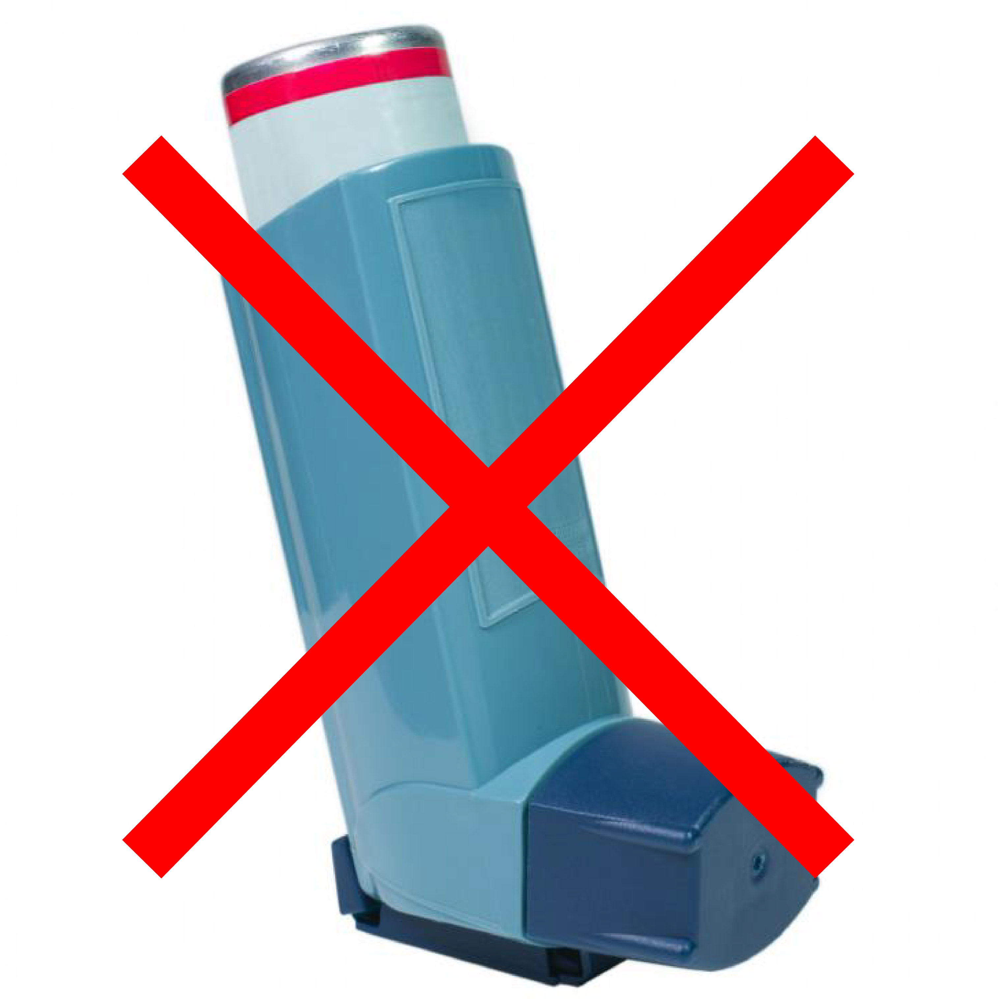

> In this article I review evidence showing that the current definition of asthma as chronic airway inflammation is not scientifically substantiated. Importantly, this problematic definition is distracting the medical community away from inexpensive therapeutic interventions that have proven to be remarkably efficient in numerous clinical trials. Read the published version of this article <a href="https://thewinnower.com/papers/asthma-revisited-is-it-really-chronic-and-incurable" target="_blank" rel="noopener noreferrer">here</a>.

Back in the 1950s asthma was defined as a reversible airway obstruction caused by the hyperresponsiveness of the Airway Smooth Muscle (ASM) to a variety of agents. Consistent with this definition, a large part of research on asthma focused in identifying several agents that could trigger a contraction of the ASM, also known as bronchoconstriction or bronchospasm.

Interestingly, carbon dioxide —a gas that our organism produces with metabolism and expels through exhalation— was found to be one of those agents. A large body of experimental evidence demonstrated that a reduction in carbon dioxide concentrations, known as hypocapnia, causes bronchoconstriction, while high carbon dioxide levels induce bronchodilation through relaxation of the ASM (references 9–22 in Bruton & Holgate, 2005 and references 1–10 in Lindeman et al., 1998). Since carbon dioxide levels are directly regulated by breathing, these findings stimulated a series of clinical studies testing the effects of breathing training on asthma symptoms. Most of these studies reported positive outcomes marked by a substantial reduction in the use of bronchodilators and corticosteroids, and improved quality of life (for a systematic review of clinical trials see Burgess et al., 2011).

Things were starting to look good for asthma patients when something unexpected happened. The definition of asthma changed! In the 1990s, the medical community agreed that asthma should be regarded as a chronic inflammatory disorder [^1]. Of course, inflammation was always suspected as one of the mechanisms responsible for airway hyperresponsiveness since inflammatory agents, mainly eosinophils, have shown to trigger bronchoconstriction and are also held responsible for structural changes observed in the airways of asthmatics. These observations, however, do not justify such a radical change in the definition of asthma. In fact, many researchers have tried to draw attention to the problems of the definition of asthma as an inflammatory disease. Their main and irrefutable argument is that the asthmatic airways are equally hyperresponsive to a variety of different, non-inflammatory stimuli. Indeed, in a large number of studies no significant correlations were found between airway inflammation and airway hyperresponsiveness, showing that "airway hyperresponsiveness may be present even in the absence of demonstrable inflammatory cells in the airway lumen or mucosa, which suggests that the presence of inflammatory cells in the airways is not necessary to sustain hyperresponsiveness" (Brusasco et al., 1998). In other words, it is very common to encounter asthma symptoms due to airway hyperresponsiveness without inflammation, while it is also very common to find patients with airway inflammation without bronchoconstriction, for example in cases of allergic rhinitis where patients present eosinophilic inflammatory responses without asthma symptoms.

In short, all the available evidence indicates that although inflammation may play a role in airway hyperresponsiveness, it is certainly not the only or even the main cause of the airway obstruction observed in asthma. Unfortunately, for the moment the medical community is choosing to ignore this fact with detrimental consequences for the treatment of asthma. First of all, the inflammation theory of asthma fails to explain bronchospasm incidents caused by laughter, crying, stress, exercise and other similar, seemingly harmless activities [^2]. Indeed, inflammation-induced symptoms account only for a small percentage of total asthma incidents.

Another, even more important consequence of the inflammation theory is that it blocks the way to treatments aiming to reduce hyperventilation, and thus increase carbon dioxide concentrations, using breathing training. Many physicians fall into the "definition trap" and claim that since asthma is a chronic inflammatory disorder and breathing has no observable effect on the control of inflammation, breathing exercises for asthma are useless. However, the effect of carbon dioxide on the relaxation of the ASM is beyond any doubt and should therefore come as no surprise that in almost all clinical trials where breathing training to increase carbon dioxide levels was used, patients were able to get rid of bronchodilators within a few days or weeks.

It is also remarkable that the current definition of asthma as chronic inflammation is even inconsistent with the established diagnostic and treatment protocols. Despite the change in definition from airway hyperresponsiveness to chronic inflammation, asthma continues to be diagnosed with the spirometry test. It is important to understand that this test can only detect bronchoconstriction and *not* inflammation. When spirometry measures improve after a dosis of a short-acting bronchodilator, the only thing we can confirm is airway obstruction due to ASM contraction. This is because the only effect of bronchodilators is to relax the ASM; they have *no* influence over inflammation. To make it clear: spirometry diagnoses bronchconstriction, not inflammation. Paradoxically however, many physicians prescribe corticosteroids on a patient's first visit, based not on the diagnosis, but on the definition of the disease, which, as I have argued, is not scientifically justified. Patients then start taking corticosteroids for an inflammation they probably do not have, at least not in the beginning of the course of the disease. With time, the use of long-acting bronchodilators, such as salbutamol and fermoterol, together with the daily use of corticosteroids can indeed produce airway inflammation, converting the current asthma definition into a self-fulfilling prophecy! Again, it should come as no surprise the conclusion of a meta-analysis of 19 trials including 33,826 patients that "long-acting β-agonist [bronchodilators] use increases the risk for hospitalizations due to asthma, life-threatening asthma exacerbations, and asthma-related deaths. Similar risks are found with salmeterol and formoterol and in children and adults. Concomitant inhaled corticosteroids do not adequately protect against the adverse effects. The use of long-acting β-agonists could be associated with a clinically significant number of unnecessary hospitalizations, intensive care unit admissions, and deaths each year. Black box warnings on the labelling for these agents clearly outline the increased risk for asthma-related deaths associated with their use, but these warnings have not changed prescribing practices of physicians" (Salpeter et al., 2006).

The scientific evidence cries out for recognition. Airway hyperresponsiveness is the main mechanism behind asthma symptoms, at least in patients that have not received combined bronchodilator and corticoid treatment for a long period of time. This hyperresponsiveness can be tackled with breathing training aimed at normalising carbon dioxide concentrations. We can even hypothesise that ASM contraction is the body's way of telling us we should reduce over-breathing in order to maintain healthy carbon dioxide levels in the lungs and blood stream. Instead, physicians assist patients in artificially relaxing the smooth muscle with the daily use of bronchodilators, thus cancelling out a defence mechanism and aggravating the primary condition. This may explain the fact that asthma mortality rates increased worldwide in the 1960s, when inhaled β-agonists were introduced on the market (Hussey et al., 2006).

The details behind the decision to change the definition of asthma worldwide despite the lack of scientific evidence to support this change, as well as the decision of leading pharmaceutical companies to combine two pharmacologically incompatible medicine, such as bronchodilators and corticosteroids, into one inhaler, merit serious investigation. In the meantime, and until the medical community finds the courage to face the facts and admit its errors, patients need to be informed that their condition is not necessarily chronic and incurable. A significant number of patients worldwide have gotten rid of their asthma through breathing training. It is not blasphemy to claim that asthma can be cured. It is however immoral to condemn people to unnecessary life-treatment based on limited scientific evidence.

This article was also published here: <a href="https://thewinnower.com/papers/151-asthma-revisited-is-it-really-chronic-and-incurable" target="_blank" rel="noopener noreferrer">https://thewinnower.com/papers/151-asthma-revisited-is-it-really-chronic-and-incurable</a>

---

**Footnotes**

[^1]: Example of this definition in the USA: [National Heart, Lung, and Blood Institute. National Asthma Education Program Expert Panel Report. (2007).](https://www.nhlbi.nih.gov/files/docs/guidelines/asthgdln.pdf) and in Spain: [Guía Española para el Manejo del Asma (GEMA). (2009)](http://www.gemasma.com/images/stories/GEMASMA/Documentos/GEMA%202009/index.html).

[^2]: Clinical evidence suggests that 41.9–61% of patients have suffered at least one laughter-induced asthma attack (<http://www.sciencedaily.com/releases/2005/05/050524230036.htm>).

**References**

Brusasco, V., Crimi, E., and Pellegrino, R. (1998). Airway Hyperresponsiveness in Asthma: Not Just a Matter of Airway Inflammation. *Thorax* 53 (11): 992-998.

Bruton, A., Holgate, S.T. (2005) Hypocapnia and Asthma: A Mechanism for Breathing Retraining? *Chest* 127(5): doi:10.1378/chest.127.5.1808.

Burgess, J., Ekanayake, B., Lowe, A., Dunt, D., Thien, F. and Dharmage, S.C. (2011). Systematic Review of the Effectiveness of Breathing Retraining in Asthma Management. *Expert Rev Respir Med* 5 (6): doi:10.1586/ers.11.69.

Hussey, P.S, Anderson, G.F., Osborn, R., Feek, C., McLaughlin, V., Millar, J. and Epstein A. (2004). How Does the Quality of Care Compare in Five Countries? *Health Affairs* 23 (3): doi:10.1377/hlthaff.23.3.89.

Lindeman, K.S, Croxton, T.L., Lande, B. and Hirshman, C.A. (1998) Hypocapnia-induced Contraction of Porcine Airway Smooth Muscle. *European Respiratory Journal* 12 (5): doi:10.1183/09031936.98.12051046.

Salpeter, S.R., Buckley, N.S., Ormiston, T.M., Salpeter, E.E.(2006). Meta-analysis: Effect of Long-acting Β-agonists on Severe Asthma Exacerbations and Asthma-related Deaths. *Annals of internal medicine* 144 (12): 904-912.
