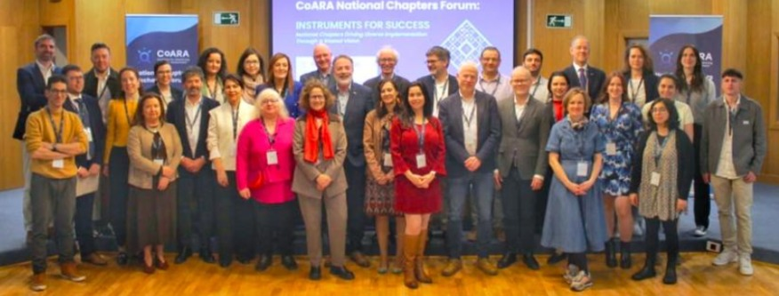
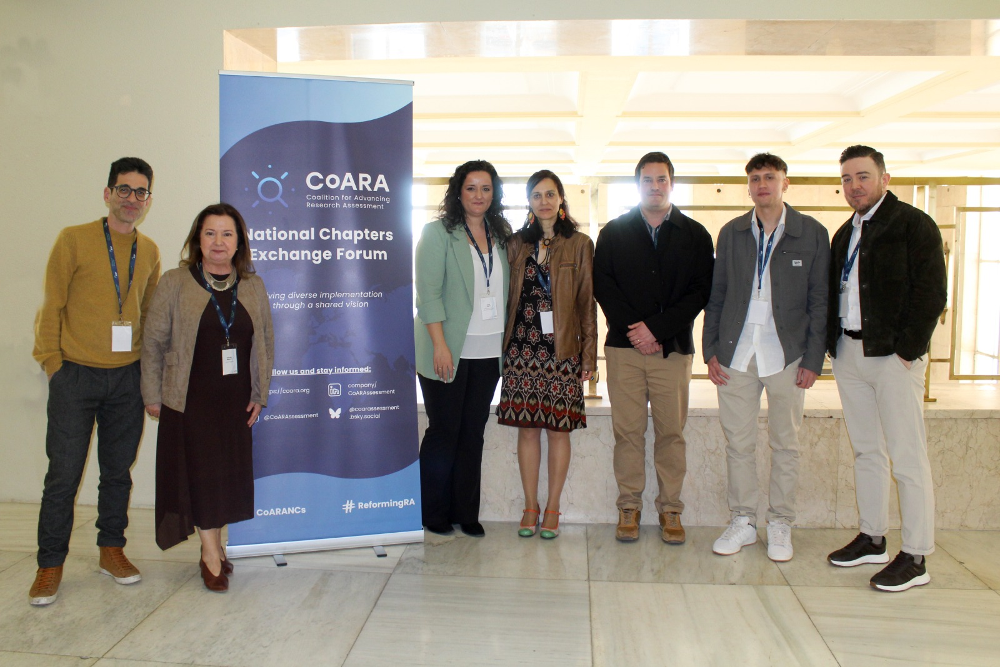

The third Forum of National Chapters of the <a href="https://coara.eu" target="_blank" rel="noreferrer noopener">Coalition for Advancing Research Assessment (CoARA)</a> was held on **March 19–20, 2026** at the **Sala de Grados, Faculty of Medicine, Complutense University of Madrid** (Pl. de Ramón y Cajal, s/n, 28040 Madrid).

The forum was co-hosted by ANECA, CSIC, CRUE and ISCIII, and this year's theme was:

> *"Instruments for Success: National Chapters Driving Diverse Implementation Through a Shared Vision"*

Building on last year's exploration of pluralistic definitions of success in Bonn, the Madrid forum focused on the instruments, tools and frameworks that national chapters can develop to advance the implementation of research assessment reform at regional and national levels. It also served as a platform for strategic exchange between the CoARA Steering Board and National Chapter representatives.

Several sessions on March 19 were open to the public and available for online participation, including the institutional opening, keynote presentations from the Spanish National Chapter, the European Commission, and the CoARA Steering Board, as well as a spotlight session in which multiple national chapters shared their experiences and lessons learned.

  <figure style="flex:1; min-width:200px; margin:0;">
    
    <figcaption style="font-size:0.85em; color:var(--bs-secondary-color); margin-top:0.4rem;">CoARA Steering Board and National Chapter representatives.</figcaption>
  </figure>
  <figure style="flex:1; min-width:200px; margin:0;">
    
    <figcaption style="font-size:0.85em; color:var(--bs-secondary-color); margin-top:0.4rem;">Representatives of the Spanish National Chapter.</figcaption>
  </figure>

