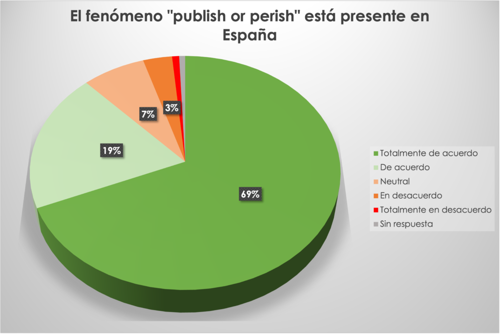
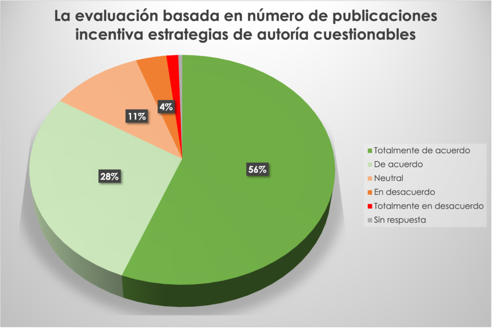
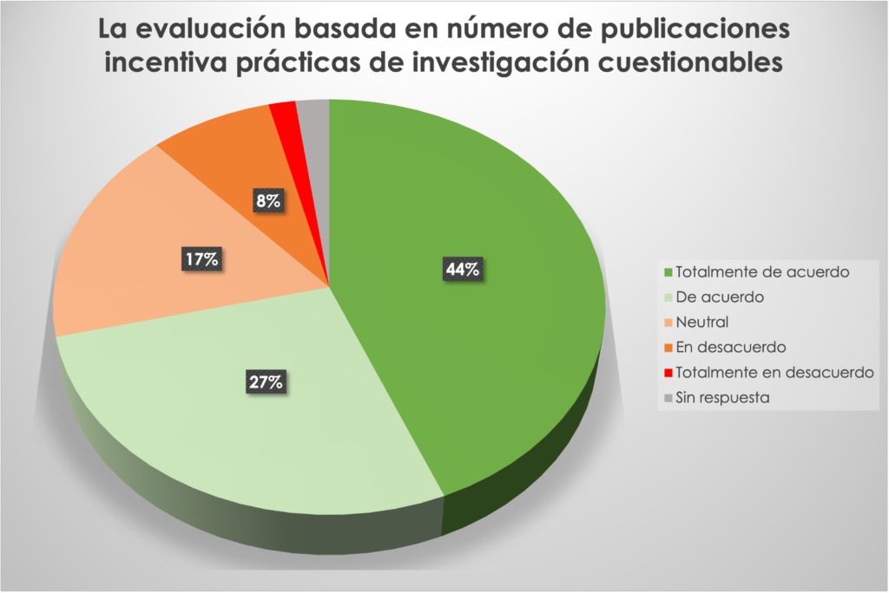

<p><a href="/blog/researchers-evaluated-spain">Read in English</a></p>

<p>Recientemente publicamos los resultados y los datos completos de una encuesta en la que se pedía a 875 académicos investigadores que viven y trabajan en España su opinión sobre la importancia que debería tener una selección de 39 criterios diferentes en la evaluación de los CV de investigación de los candidatos en un proceso de contratación. En una segunda parte de la encuesta también preguntamos a los participantes sobre su nivel de acuerdo con una serie de afirmaciones relativas a las prácticas de evaluación de la investigación.</p>

<p>La motivación inicial de esta encuesta era mostrar que los académicos en España están insatisfechos con la forma en que se evalúa actualmente su producción investigadora y proponer alternativas para mejorar la evaluación de la calidad científica/académica. A la vista de los resultados, no creo que podamos afirmar que este objetivo se haya conseguido.</p>

<p>En la segunda parte de la encuesta, el 88% de los participantes considera que el "publicar o perecer" es un problema existente, el 84% piensa que la evaluación basada en el número de artículos publicados fomenta estrategias de autoría cuestionables y el 71% está de acuerdo en que esa forma de evaluación promueve malas prácticas de investigación. Aunque esto parece alentador, el número de artículos publicados se clasificó como el segundo criterio de evaluación más importante (después de ser IP o co-PI en proyectos de investigación). ¿Significa esto que contar el número de artículos es malo pero es lo mejor que tenemos? Al mismo tiempo, el 70% está de acuerdo en que sería preferible basar la evaluación de la investigación en un número predeterminado de las mejores contribuciones. ¿Este método, que ya aplican algunas agencias nacionales de evaluación, podría apuntar en la dirección correcta?</p>



<p>A pesar de lo mucho que se ha dicho y escrito sobre la irrelevancia del Factor de Impacto para la evaluación de los autores individuales, este criterio fue calificado como el décimo más importante, con un 54% de los participantes que lo consideraron "muy" o "bastante importante". El índice de Hirsch se consideró menos importante y ocupó el 16º lugar.</p>



<p>Otra observación desalentadora fue que la publicación de estudios prerregistrados no se consideró relevante para la evaluación de la investigación, ocupando el 36º lugar en el orden de importancia, con un 51% de los encuestados que lo calificaron de "poco importante" o "nada importante". Al mismo tiempo, la publicación de preprints fue el criterio menos importante, calificado como poco o nada importante por el 60% de los participantes. Aunque la importancia de los preprints no varió en función de la disciplina o la edad, resulta prometedor que el prerregistro se considerara más importante entre los investigadores más jóvenes (22-40 años) de las ciencias de la vida, ya que "sólo" el 28% de los encuestados lo consideraron poco importante.</p>



<p>La inclusión de una entrevista en el proceso de contratación, que actualmente sólo implica la presentación de un CV en un formato específico que varía de una institución a otra (!), fue apoyada por el 79% de los encuestados y ocupó el noveno lugar en orden de importancia. Curiosamente, al dividir los resultados por género, parece que las mujeres tienden a considerar la inclusión de una entrevista como menos importante que los hombres: este criterio ocupa el séptimo lugar para los hombres y el decimoséptimo para las mujeres.</p>

<p>Otra cuestión crucial para el sistema de evaluación español es quién debe participar en los comités de evaluación: sólo miembros internos del departamento que abre el puesto, sólo miembros externos al departamento, o ambos. Esta cuestión es especialmente relevante, ya que el sistema de evaluación español ha sido acusado repetidamente de endogamia, favoreciendo a los candidatos afiliados al departamento contratante en detrimento de los solicitantes externos. Según nuestros resultados, la mayoría de los encuestados cree que los comités de evaluación deberían estar compuestos por miembros internos y externos, pero todavía un 12% cree que los candidatos deberían ser evaluados sólo por miembros internos.</p>

<p>En general, parece que aún queda mucho camino por recorrer para concienciar a los investigadores en España, donde todavía se valoran los índices a nivel de revista para la evaluación individual y no se reconoce la importancia de prácticas que mejoran claramente la calidad de la investigación, como el prerregistro de los estudios experimentales. A pesar de estas preocupaciones, nuestra encuesta también muestra que la mayoría de los investigadores reconocen que el sistema actual conduce a malas prácticas e incluso sugieren mejoras ampliamente respaldadas, como el uso de un número predeterminado de mejores contribuciones para la evaluación, o la inclusión de una entrevista por parte de un comité compuesto por miembros externos e internos.</p>

<p>Las observaciones destacadas aquí son sólo algunas que me llamaron la atención. Cualquier persona interesada puede acceder a los datos completos y al informe que se encuentra <a href="https://zenodo.org/record/6136707#.YxZY2y8RppQ" target="_blank" rel="noreferrer noopener">aquí</a> y también utilizar el gráfico interactivo que se muestra a continuación, con varias opciones de filtro (por edad, género, disciplina y estatus profesional).</p>

```{=html}
<div id="viz1665929571245" class="tableauPlaceholder" style="position: relative; width: 100%; margin: 1.5rem 0;">
  <noscript>
    <a href='#'></a>
  </noscript>
  <object class="tableauViz" style="display:none;" width="100%" height="600">
    <param name="host_url" value="https%3A%2F%2Fpublic.tableau.com%2F" />
    <param name="embed_code_version" value="3" />
    <param name="site_root" value="" />
    <param name="name" value="EncuestaCVinvestigador/Story1" />
    <param name="tabs" value="no" />
    <param name="toolbar" value="yes" />
    <param name="animate_transition" value="yes" />
    <param name="display_static_image" value="yes" />
    <param name="display_spinner" value="yes" />
    <param name="display_overlay" value="yes" />
    <param name="display_count" value="yes" />
    <param name="language" value="en-GB" />
  </object>
</div>
<script type='text/javascript'>
  var divElement = document.getElementById('viz1665929571245');
  var vizElement = divElement.getElementsByTagName('object')[0];
  vizElement.style.width = '100%';
  vizElement.style.height = (divElement.offsetWidth * 0.75) + 'px';
  var scriptElement = document.createElement('script');
  scriptElement.src = 'https://public.tableau.com/javascripts/api/viz_v1.js';
  vizElement.parentNode.insertBefore(scriptElement, vizElement);
</script>
```
