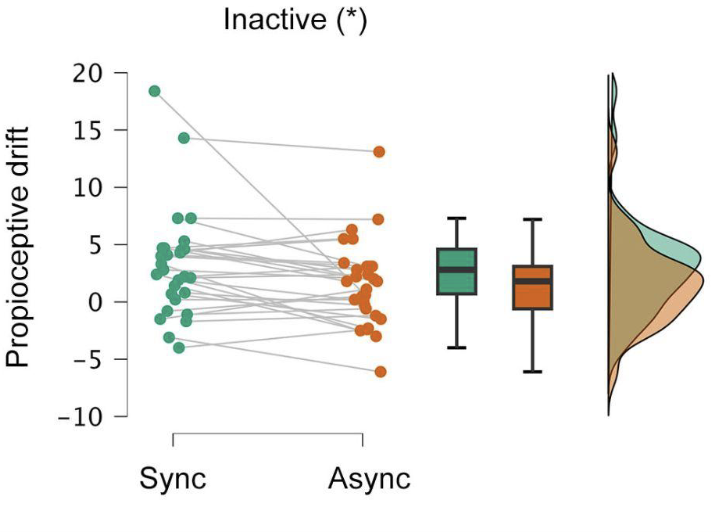

[Leer en Español](https://perakakis.github.io/2023/09/03/djokovic-vs-ciencia/)

What triggered the following thoughts on the strengths and limitations of science — a favorite topic, I admit — was the outpouring of criticisms in response to a tweet by @jmgmoron highlighting the dietary habits of tennis superstar Novak Djokovic. The criticisms primarily centered around a perceived lack of scientific evidence supporting Djokovic's dietary choices.

<blockquote>

Un cuerpo cuidado al máximo desde hace más de una década. No solo a través del trabajo físico, sino también a través de la alimentación. ASÍ ES LA DIETA DE NOVAK DJOKOVIC. Revelada por él mismo. Os sorprenderá

<footer>— <a href="https://twitter.com/jmgmoron/status/1693717747421573179" target="_blank" rel="noreferrer noopener">@jmgmoron, August 21, 2023</a></footer>
</blockquote>

To provide some context, Novak Djokovic famously overcame the health problems that plagued his early career by changing his diet, primarily by eliminating gluten. According to Novak himself, this change was instrumental in catapulting his performance and helping him become the most prolific player in tennis history (number of Grand Slams, Masters titles, weeks as number 1, etc). He then went on to publish a book titled "Serve to Win", documenting his experience and inviting people to open-mindedly experiment with their diet to discover what works best for them.

So, here we have on the one side the testimony of a single person who claims that his diet helped him reach levels of physical and mental performance never before seen in tennis, and on the other, a large number of people, including professional nutrition researchers, eager to dismiss all these claims in order to protect people from any advice that lacks scientific evidence.

Why were so many people fired up by this tweet? Why are most of the responses, including those from scientists, so emotionally charged?

Who grants the authority and the confidence to question, or even ridicule, the credibility of one of the greatest athletes of all time in any sport?

But of course, the answer is SCIENCE.

**Science is the new religion**, so powerful and authoritative that it can burn at the stake even the best of the best.

And before I piss off and lose half the readers, let me acknowledge that science is the best tool we have to reduce uncertainty about the world and about ourselves. The scientific method is undoubtedly the pinnacle of human achievement that has allowed us to understand how nature works and to use this knowledge to our ends.

So, if Science claims that eating food X will or will not have the effect Y on your health or performance, it must be correct, right?

Here is exactly where most people, even professional scientists, get it wrong.

How do scientists arrive at the conclusion that food X does or does not have an effect Y? Of course, there are methods to test the effects of different substances down to the molecular level, but in these cases it is impossible to know with certainty what will happen in real life when a particular person consumes the substance in question. This is because each chemical can evoke multiple responses in different cells and organs depending on a multitude of other parameters that are impossible to identify, let alone control. We all know this from drugs and their side effects. There is no scientist or doctor who can assure you 100% that taking a particular drug will only have the desired effect without any unexpected consequences. The same is true, of course, with foods and their multiple ingredients.

Much of the scientific evidence, however, comes from studies involving rather large numbers of people who are, at best, randomly divided into two groups, one taking the substance or food and the other not taking it. After a period of time, the two groups are compared in terms of the effect being tested. These tests are statistical in nature and their results can be crudely summarized — and are summarized by the media and science communicators — as a yes or no answer. There either is or is not a specific effect of ingesting substance X.

This oversimplification contributes to maintaining the status of Science as the new religion. The authority that holds the one and only undeniable Truth. A single study of 60 people finding no statistical effect of a particular food, drug or treatment is translated by the media as:

"Eating X will not help you become Y, *scientists find*"

or

"*Science* does not support that X causes Y".

Instead, it would be more accurate to say:

"A study conducted by 4 scientists from the same lab on 60 people, not representing the real population, finds that the effect of X on Y is not statistically significant".

Two things are absolutely crucial to understand here.

First, that the sample is **not representative**. For example, the study may have been conducted on university students or on predominantly sedentary people. This means that we cannot generalize its results to older or to physically active people. For unidentified reasons, the effect of X on these people may be completely different!

Second, that the effect is not **statistically significant**. Or, in simpler words, it is not significant on average. This means that there may have been several people in the study who experienced an effect and even a large one. However, this effect is masked by the fact that most people showed no effect or even presented an inverse effect. This means that we have absolutely no clue what the impact of X will be on a particular individual!

<figure style="text-align:center;">

<figcaption>To illustrate this point, the figure above is from our own research. It shows no significant average effect for a variable we've termed "Proprioceptive Drift" (though this could be any measurable variable of interest, such as symptoms of a disease), when comparing two specific conditions: Synchronous and Asynchronous. While the average shows no significant change, several individuals do exhibit a large shift in Proprioceptive Drift when transitioning from the "Synchronous" to the "Asynchronous" condition. Notably, one individual (represented by the top green dot on the graph) shows a dramatic decrease between the two conditions. If this study were evaluating a drug, and someone with similar characteristics chose not to try it based solely on the average statistical outcome, they would miss the opportunity to potentially benefit from it — perhaps even curing a disease.</figcaption>
</figure>

Going back to Djokovic and his diet, what if it truly worked for him — his performance and results definitely show that it did. What if it works only for 20% of the people, but you are in that group and it doesn't cost you anything to try it for 2 weeks — this is what Djokovic modestly suggests in his book. Why on earth would anyone be so obsessed with trying to talk you out of it in the name of Science?

My guess is that many non-scientists have fallen into the Holy Science trap (crap). They truly believe that Science is a single organism with an infallible mechanism for reaching consensus on almost any issue and that all scientists are representatives of this united, sacred institution.

On the other hand, many scientists recognize — or at least should recognize — the limitations of the scientific method but prefer to look the other way. For not to do so would call into question their status as high priests entitled to give an opinion on any matter remotely related to their field of expertise.

Then there is another group of scientists who have taken up the fight against a plethora of New Age bullshit, frequently propagated by individuals with little understanding of the scientific method, who envy the often undeserved but real status of the scientific establishment to which they do not belong.

However, it seems to me that this latter group of scientists often takes this struggle so much to heart that they overestimate the strengths of the scientific method.

Djokovic openly shares his testimony as a single case study (and what a case it is!). More importantly, he goes to great lengths to clarify that what worked for him may not work all the time and with everyone. You just have to experiment and find out. He is not selling anything, just inviting to healthy, open-minded experimentation. Test and assess. This, by definition, is a scientific approach.

What is clearly unscientific is the authoritarian, disrespectful and pretentious language in many of the comments I've read in response to this Twitter thread, some of which, as I mentioned, come from professional researchers who should know better.

So, to be fair, it is not "Djokovic" vs "Science".

The real match is **"Djokovic" vs "Bad Scientists"**:

Score: 1–0.
