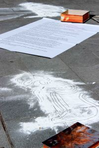

La segunda edición de la iniciativa "<a href="/blog/universidad-a-la-calle/" target="_blank" rel="noopener noreferrer">Universidad a la Calle</a>" en la plaza Bib-rambla en 15 de Marzo. En las palabras de **Alfonso Maso**, profesor de Bellas Artes:

Hay llamas que arrasan. No permitamos más rejas, más señales de dirección obligatoria al sentido del pensamiento y las palabras. Surgió La Barraca en Granada para provocar pequeños incendios en inesperados interiores, en lugares sin importancia y apenas con nombre. La propia Barraca pudo ser calcinada por el odio de los generales y por la muerte silenciada de quienes no olvidaron, pero siempre permaneció latente en escondidas cenizas.

Parece a veces que el tiempo se abre demasiado lento mientras las nuevas calaveras de plomo paralizan, omnipresentes, por el miedo, la libertad de hablar por los caminos. Intentando retener los vientos que alentarían las ascuas dormidas. Solo intentándolo...No sabemos aún por cuanto tiempo, si no reaccionamos; por cuanto tiempo se mantendrán los márgenes de las carreteras sin los nuevos tricornios de las nuevas trinidades.

...Así pensábamos en voz alta, entre el mucho ruido, El viernes 15, en la presentación del Mercao Social, donde nos encontramos algunas personas participantes en La universidad a la calle... valorando fuerzas, contextos y posibilidades ante la evidencia de que nuestro trabajo se quedaría casi invisible si no nos poníamos con decisión el mono de trabajo y nos echábamos de verdad a la calle. Con una posible estructura semejante a la actual pero ampliada a institutos, colegios y otros colectivos de la cultura castigados por el actual proceso de desahucio. Echarnos de verdad a la calle, más allá de emblemáticos lugares de los centros de las ciudades: por barrios y pueblos. Con una presencia y visibilidad permanente, con una permanente transformación de nuestras "excelencias", exactamente en el sentido inverso al que quieren imponernos: La cultura jamás puede ser negocio.

La situación requiere actuaciones sin precedentes porque jamás ocurrió nada semejante en la historia. Hemos comprobado, al día siguiente de nuestra "actuación" en Bib-Rambla, el silencio casi general de los medios, mientras sí amplifican las declaraciones del rector: sembrando la sospecha de deshonestidad sobre todo el profesorado, como ya comenzara a hacerlo en Madrid, Esperanza Aguirre, en las etapas preparatorias del desmantelamiento y la privatización.

Sólo podremos sobrevivir a esta situación cambiando radicalmente de estrategias, multiplicando nuestra presencia y nuestras voces en las calles, es decir, multiplicando nuestros medios de comunicación e implicación, eliminando barreras que jerarquizan, distancian y dividen.

La propuesta de La Barraca Incendiada parte, cómo no, de retomar nuestra cultura más inmediata y contemplar el estado de ruina al que se ve abocada. De la necesidad imperiosa de reaccionar a tiempo y convertir las llamas con las que quieren reducirnos a cenizas, en nuestra propia fuerza expansiva, propagadora, generadora de inevitable insurgencia.

Cuando todo, a nuestro alrededor, es cercenar, cercenarnos, acotarnos, es el momento inaplazable de expandir, fortalecer, empoderar, generar conciencia divergente, pensamiento divergente, pertrechado con reinventados horizontes de sentido.

No nos pueden servir tibiezas ni esperas de milagros externos sino actuar, cada pequeño grupo cobrando conciencia de sus propias fuerzas, su propio poder y su propio alcance, por encima de incomodidades, de programas docentes que inevitablemente mintieron y mienten, a pesar de nuestro esfuerzo.

El mismo viernes por la noche, mientras valorábamos estas ideas se nos acercó Pani, concejal del Ayuntamiento de Peligros con la intención de invitarnos a "actuar" en esa localidad, coincidiendo con la Feria del Libro, entre el 17 y el 20 de abril; nuestro sí fue por delante.

Media el tiempo de valoración de estrategias, de maduración de ideas y alianzas, de consensos sobre a quién o no se representa. Cada uno, cada una representamos la urgencia no sólo de preservar el acceso a la cultura sino de defender el elemental derecho a pensar. Por encima de cualquier tipo de siglas:

**Pensamiento insurgente como defensa y semilla de las culturas.**


