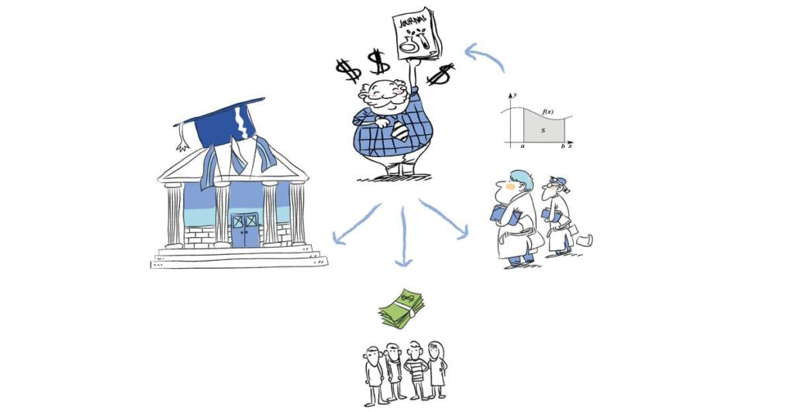

A few months ago, an intriguing email landed in the inbox of the academic journal <a href="https://psicologicajournal.com" target="_blank" rel="noopener">Psicológica</a>. The subject line read, "Journal Acquisition and Management Proposal." What followed was a fascinating journey into the little-known world of <strong>academic journal acquisitions</strong>.

The email was eloquently written and signed by the director of a Singapore-based company specializing in representing publishers in negotiations for acquiring academic journals. Attached was a PowerPoint presentation detailing the acquisition process. In essence, the proposal offered to hand in all legal rights to a new publisher and reflect this change to the ISSN portal and indexing services. The editorial board could either sign a new contract, potentially with an annual salary, or resign. The starting point for negotiations? A decent <strong>$80,000</strong>.

While my colleagues had previously ignored similar proposals, my curiosity got the better of me. I arranged an online meeting with the company's CEO, who was both polite and professional. When I inquired about maintaining our Diamond Open Access model, he assured me it was possible. After some prodding, he revealed their grand plan: to acquire around 100 journals and then sell them to a large commercial publisher. In his words, <strong>"We are now building our empire."</strong>

Although not explicitly confirmed, I sensed that a major publisher was already backing this venture, and a future merger had likely been negotiated. When I asked about their maximum bid for our modest journal, the ceiling was set at an astonishing <strong>$300,000</strong>.

I politely thanked him for his proposal and promised to present it to the editorial board, curious to see if he would raise his offer even more. While he did not adjust the price, he persisted with a couple of emails, until I made it clear that the board had declined his offer.

### Conclusion

In our 2008 article, "<a href="https://doi.org/10.3354/esep00086" target="_blank" rel="noopener">The Siege of Science</a>," we discussed the issue of journal mergers and their detrimental effect on the "serials crisis". However, I admit that the outsourcing of acquisitions came as a surprise. Large publishers seem to be employing third-party companies to handle negotiations, perhaps as a strategy to reduce resistance from journal owners. After acquiring the small company's entire portfolio, they are free to include it in their subscription bundles, or convert some or all journals to a pay-to-publish model, which can bring in revenue by exploiting authors' urgency for rapid, albeit lower-quality, publications. Converting an existing journal that already has a reputation and is indexed in databases is both quicker and more straightforward than launching a new one, especially considering that inclusion in indexing databases can be a lengthy and uncertain process.

If you owned a scholarly journal, what would your price be? If the editors can keep their positions, the details of the acquisition can remain confidential. How many such acquisitions have been negotiated in the dark? Does this mean that scholarly societies bear even greater responsibility for the commercial takeover of scholarly communication than previously thought?

