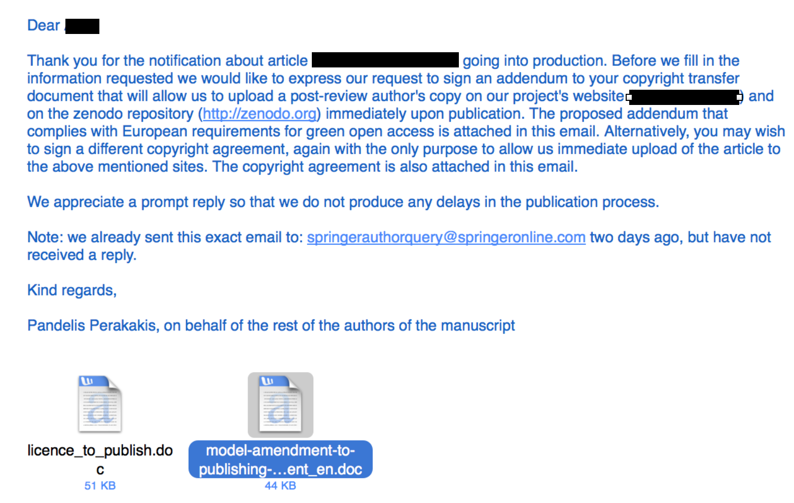
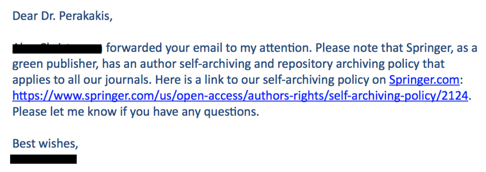
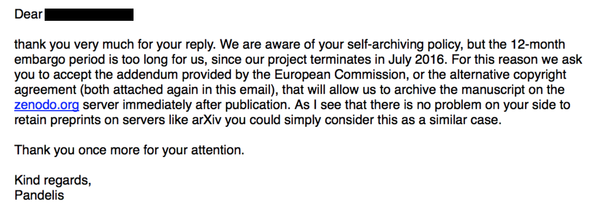
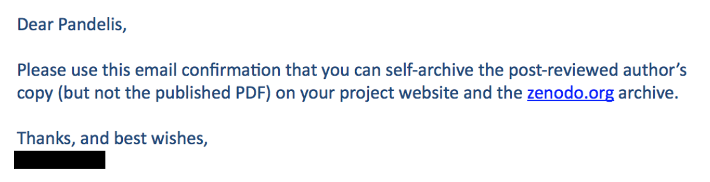

> In this post I share a recent experience as an example of how to negotiate with a publisher your right to make your research freely available without having to pay any money. Hope it proves useful to more researchers in a similar position. I also offer my personal opinion on how researchers can change the current inefficient and unethical system of scholarly communication by gradually developing an alternative model that will foster collaboration instead of competition.

A few days ago one of my co-authors happily announced via email that our paper was accepted by a Springer journal. Knowing that I am deeply involved in the open science movement she asked me whether we should consider paying 2,200 EUR (excl. VAT) to order the Open Choice and publish the article as open access. I replied that I appreciate her concern, but that authors should never pay any money for making their work available to all, and asked her to let me write an email to the publisher to ensure open access at no cost. She was a little surprised, but mostly frightened. You see, she is a PhD student and desperately needed this publication to be able to defend her thesis before the end of the year. She was afraid that the almighty publisher could eventually turn down our paper if we showed any kind of disrespect or inappropriate behaviour. I assured her that I would not do anything to put the publication at risk and got her permission to proceed. After that, I sent my first email to the publisher:

Both of the attached files in this email can be found at: <a href="https://www.openaire.eu/copyright-issues/copyright/copyright-issues">https://www.openaire.eu/copyright-issues/copyright/copyright-issues</a>. However, the original files allow the publisher to impose an embargo period of maximum 6 months before the author can self-archive the article. This condition comes inside a parenthesis that I simply deleted.

A day later I received the following reply:

If you follow the link mentioned in the publisher's email you will see that Springer allows self-archiving 12 months after publication, which I consider unacceptable. So I had to insist. I wrote back:

And after this second email, I received the reply I was expecting:

After that everything was simple. I logged in to my <a href="http://www.zenodo.org">zenodo.org</a> account and uploaded the author's copy of the manuscript. As a result, anyone searching for the article on <a href="https://scholar.google.com">google scholar</a> will find the publisher's version requesting 34.95 EUR for pdf access, and right next to it a link to exactly the same article freely available via Zenodo. That's it! Nice and clean! Many thanks to Jon Tennant (@Protohedgehog) for motivating me to share this experience and hope it proves useful as an example of how to negotiate with a publisher your right to make your research freely available without having to pay any money.

If you wanted to know the exact process I followed to immediately self-archive an article despite the publisher's embargo policy then you can stop reading here. If, however, you are also interested in my personal opinion on what we, scholars, can do to change this ridiculous system —in the past I have used many different adjectives to characterise it, but right now this strikes me as the most appropriate— please go on.

Well, I feel that the above story contains an interesting message. First of all, despite my open science background and fierce critic against the current publication system I did not feel I had the right to influence my co-author's choice of journal. She is a young researcher whose future largely depends on whether she will be able to defend her thesis before she runs out of money. And this absolutely depends on whether she will be able to publish at least one article in an ISI journal before the end of the year. In addition, this particular journal has a decent impact factor and considerable prestige in its field that can help my young colleague attract attention and stand a better chance in the job market. But thinking about it twice, why should I argue against publishing in this journal if with the simple process described above I have been able to guarantee open access at absolutely zero cost? To me the message is obvious. Thanks to the immense efforts of the green open access movement, the problem of restricted access can easily be solved using existing infrastructures and with a small additional effort on behalf of the authors or their librarians. A global and permanent solution should be only a matter of educating scholars. What's all the fuss about open access journals then? In the words of publishers themselves:

> "Gold OA represents a business opportunity, whereas Green OA represents a business problem." —Joseph Esposito, management consultant in the publishing industry.

In my words, open access publishing is an opportunity for the system to change its face without suffering a massive disruption from the consciousness awakening of scholars.

But why should we disrupt the system? The true reason this systems needs to change is not the restrictions to content imposed by traditional publishers. This problem has already been solved with self-archiving. I have discussed what I perceive as the real problem in several occasions and here I will just copy an excerpt from <a href="http://blogs.lse.ac.uk/impactofsocialsciences/2013/08/20/libre-project-open-peer-review-perakakis/">an article I wrote for the Impact of Social Sciences blog back in 2013</a>:

> "Today's academic publishing model treats knowledge —in the form of the academic article— as a material good. Instead of collaborating to shape new scientific ideas and communicate them to the research community and the public in general, scholars are forced to compete for a limited number of prestigious publication slots. As a result, science advances slower and less efficiently than it should, and young researchers entering their fields with a genuine aspiration to contribute to global knowledge are soon confronted with the ruthless 'publish or perish' reality. And this is something humanity cannot accept."

The conclusion is inevitable. To regain our lost enthusiasm and better serve science and society we need to move from a system that rewards competition to one that rewards collaboration. And we need to do this gradually and fighting from within. We cannot ask young researchers to risk their careers by publishing in journals that are not highly regarded by Universities and funding agencies. Instead, we can persuade them to spend some additional time to post their best research to existing open access repositories. We need to tweak these repositories to enable formal evaluation and constructive feedback from the community, and to add advanced search functions that will allow filtering by disciplines, number of positive reviews, number of visits and downloads, etc. We need to convince both researchers and funders that exposure to the open and transparent feedback of the entire community adds a value to the research product that the current journal-driven peer review, which is always limited to few, and most commonly anonymous, reviewers, cannot possibly provide. For what is more informative of research quality, the endorsement of two or three —anonymous or not— reviewers appointed by a journal editor, or the consensus of a large group of peers that have collaborated to improve the final version of the research work and received credit for their contribution?

Importantly, to foment collaboration we need to build trust. Today I read a <a href="http://cameronneylon.net/blog/principles-for-open-scholarly-infrastructures/">blog post</a> by Geoffrey Bilder, Jennifer Lin and Cameron Neylon discussing the principles for open scholarly infrastructures and couldn't agree more. Organisations aiming to foster open scholarship need to be non-profit, community-governed and develop open source infrastructures. Community-governed means that any member of the community of scholars should be able to join the board of members and participate in the organisation's governance on equal terms. Open source means that infrastructures developed by the organisation should not depend on the future of the organisation, but that they could continue to exist and be developed after the organisation's dissolution. Non-profit means that all profit should be reinvested in the organisation's projects, instead of being distributed to stakeholders, and that all assets should be transferred to a concrete organisation of similar principles in case of dissolution.

Interestingly, reading the post I felt as it was precisely describing the principles based on which we founded <a href="http://www.openscholar.info">Open Scholar C.I.C.</a> in 2012. A couple of pissed of researchers, we decided to continue our research endeavours, but at the same time invest our free time and money to create an organisation that our similar-minded colleagues could trust and join in order to start discussing concrete ideas on how to bring change. A few years later we are a little more than 100 people running two very promising infrastructure projects —a third one to be announced very soon!— and several other initiatives. However, we still feel alone! Our idea from the beginning was to be as open as possible, not only in name, but in principle. We believe change can only come if we all sit around the same table. By "all" I especially mean those of us who have no personal interests in specific projects or initiatives, but in finding a common solution that will make the profession of researcher something to be proud of. Our optimism is realistic. There is a significant momentum in our community at the moment that we need to direct towards the development of a radically new model of scholarly communication and evaluation. We invite you to join us in this round table we have prepared for you. Or to invite us to sit at your table and merge our projects and ideas. After all, it's all about collaboration, isn't it?
