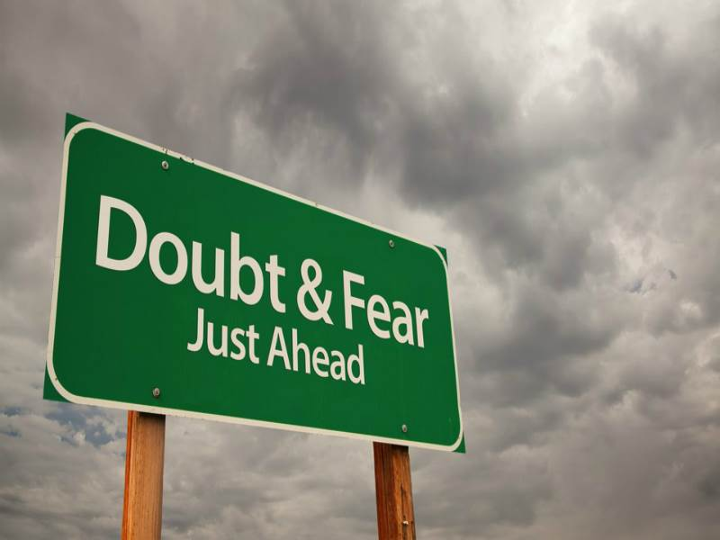
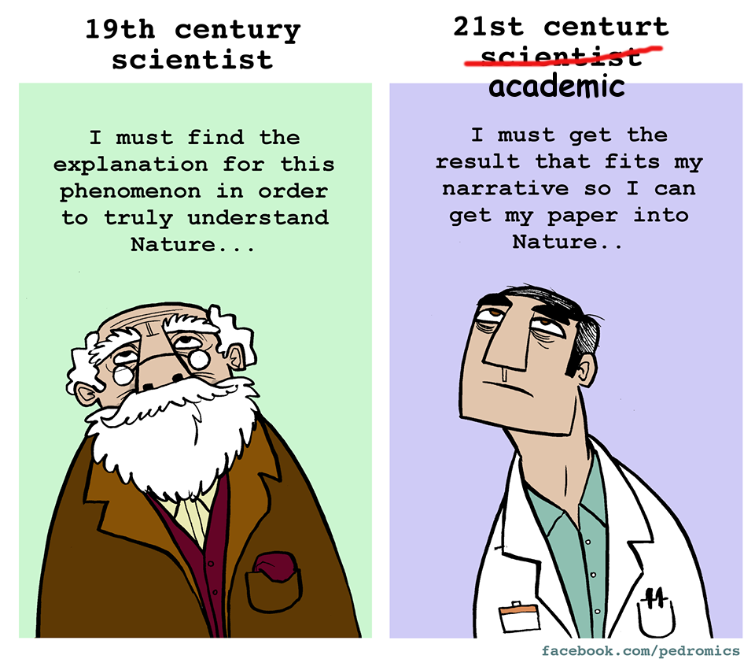

::: {.callout-note}
This post was originally published on the *EuroScientist* blog. It now survives via the [Internet Archive](https://web.archive.org/web/20230325071734/http://euroscientist.com/open-scientists-in-the-shoes-of-frustrated-academics-part-i-open-minded-scepticism/).
:::

Last week I was in Oslo, invited by the organising committee of <a href="http://eurodoc-oslo2017.org" target="_blank">Eurodoc2017</a>, to give an introductory talk on Open Science [1]. One thing that became apparent during this two-day event was that, although irresistibly trendy, Open Science remains an elusive concept. Many continue to confuse Open Science with Open Access, not to mention that almost everyone still thinks Open Access is equivalent to publishing in open access journals. In this series of posts, I will discuss a few issues that will hopefully help clarify the meaning of Open Science, why is it important, and how individual scientists can make a difference. I will start by offering my definition of Science, its purpose, and the correct approach to maximise its benefits.

<figure style="float:right; margin: 1rem 0 1rem 1.5rem; max-width: 300px;">
  
  <figcaption>Uncertainty</figcaption>
</figure>

One influential theory about the brain postulates that its main job is to optimise its predictions about future states of the world. It accomplishes this by minimising the mismatch between predictions and actual sensory data, either by gathering more data or by modifying its model of reality to better fit the data [1]. This sounds very much like a scientist's job who continuously tries to improve his or her theories, models, hypotheses, assumptions, to better describe the available empirical data. The difference is that the brain, contrary to the scientist, did not choose this profession. It evolved this way. Which implies that the scientific method is a fundamental process that evolved as the optimal strategy for the survival of the individual. What's more, reducing uncertainty by improving prediction is also crucial for our psychological wellbeing bringing feelings of safety and security. In the big picture, Science does for humanity what the brain does for the individual. This is why I like to define Science as <strong>humanity's collective effort to minimise uncertainty</strong>. This definition delimits a concrete objective for science and helps identify the correct approach to optimise its efficiency. I suggest that this optimal approach, or attitude, to maximise the benefits of Science is <strong>open-minded scepticism</strong> [2].

<figure style="float:left; margin: 1rem 1.5rem 1rem 0; max-width: 300px;">
  
  <figcaption>Scientist vs Academic</figcaption>
</figure>

An open-minded scientist does not take any predictive model (i.e., an hypothesis about how nature works) for granted but rather regards theories and models merely as sets of metaphors used to understand and communicate observable effects. He or she is always prepared to modify or completely abandon any given theory if it contradicts the available data. In other words, an open-minded scientist, aiming to reduce uncertainty at all costs, has <strong>no investment in the outcome of an experiment</strong>. A theory is valid only as long as it can account for <em>all</em> the observed data regardless of individual preferences. Scepticism, on the other hand, means that in order to be taken seriously, data should be validated through numerous and careful replications. Only data that survive the scrutiny of repeated experimentation can be used to strengthen, modify or abandon existing assumptions about the nature of reality.

The appreciation of science as an uncertainty reduction mechanism driven by open-minded scepticism can help us define Open Science as any practice that facilitates and encourages open-mindedness and scepticism. It also allows us to better comprehend the true problem with the existing academic publishing model. The issue is not that publishers make ridiculous amounts of money for little or zero added value. It is the fact that the current journal-based system does not reward open-minded scepticism. <em>First</em>, to survive in academia, scientists need to publish as many articles as possible, preferably in high-impact prestigious journals. This requires, first and foremost, to keep journal editors and reviewers happy and content. Therefore, individual preferences for theories and models that helped establish successful academic careers become a key factor in deciding what to study and under which perspective. <em>Second</em>, since scientists desperately need to publish, they have a clear investment in the outcome of their experiments, which frequently leads to the deliberate manipulation of study designs and analysis methods to achieve the desired <em>p&lt;.05</em> [3]. <em>Third</em>, scepticism is also discouraged as journals are usually looking for success stories with significant and groundbreaking findings instead of replication studies and null results. And <em>fourth</em>, you cannot obviously be a productive open-minded scepticist without open access to all data, including articles, raw data, and software code.

Most researchers today, especially those at the beginning of their careers, <em>want</em> to be scientists but <em>are forced</em> to be academics. It is more crucial than ever to change the environment to reward open-minded scepticism and thus bridge the enormous gap between science and academia. Evolution teaches us that profound environmental changes can come from subtle but constant pressure. Grassroots movements of independent scientists like <a href="http://www.euroscience.org" target="_blank">Euroscience</a>, <a href="http://eurodoc.net" target="_blank">Eurodoc</a> and <a href="http://www.openscholar.info" target="_blank">Open Scholar</a>, will continue to exert constant pressure towards the correct direction, keeping at the same time alive the hope that top-down processes, instigated by governments and institutions, will help establish the appropriate incentives to promote honest scientific enquiry, even against the interests of the academic publishing industry.

<a href="assets/Eurodoc2017.pdf" target="_blank" class="btn btn-outline-primary btn-sm"><i class="bi bi-file-earmark-slides"></i> Slides</a>

### Notes

[1] This, in brief, is the postulation of the free-energy principle, also known as the theory of the Bayesian brain or predictive coding. For more information see: Friston, Karl. "The Free-Energy Principle: A Unified Brain Theory?" <em>Nature Reviews Neuroscience</em> 11, no. 2 (2010): 127–38.

[2] A term borrowed from physicist and consciousness researcher Tom Campbell, author of "My Big Theory of Everything".

[3] To become an expert in "p-hacking" I suggest you start with these two helpful resources: <a href="https://en.wikipedia.org/wiki/Data_dredging" target="_blank">https://en.wikipedia.org/wiki/Data_dredging</a> and <a href="http://shinyapps.org/apps/p-hacker/" target="_blank">http://shinyapps.org/apps/p-hacker/</a>

