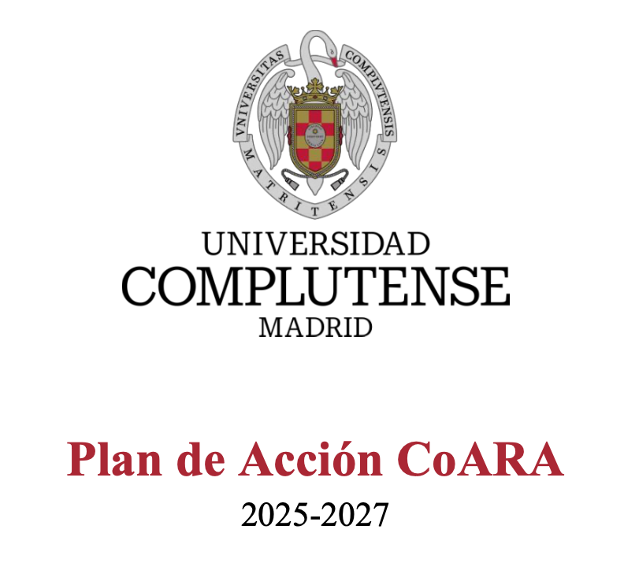

La Universidad Complutense de Madrid (UCM), la universidad presencial más grande de España, es una de las principales instituciones académicas del país con una oferta académica que abarca todas las áreas de conocimiento a través de 26 facultades y 27 institutos universitarios de investigación. La UCM firmó el Acuerdo sobre la Reforma de la Evaluación de la Investigación (ARRA) en marzo de 2023. Este documento recoge el Plan de Acción CoARA de la UCM para el período 2025–2027, elaborado por el Grupo de Trabajo CoARA de la UCM y aprobado por la Comisión de Investigación de la universidad.

El plan aborda seis de los diez compromisos del ARRA, organizados en líneas de acción que incluyen el desarrollo de criterios de evaluación cualitativos y narrativos, la formación y sensibilización de la comunidad investigadora, el intercambio de prácticas con otras instituciones, y la integración de infraestructuras abiertas en los procesos de evaluación. Entre los aspectos más destacados del enfoque de la UCM figura el desarrollo de un sistema de evaluación basado en repositorios que combina el repositorio institucional DOCTA con el Open Peer Review Module (OPRM), así como la participación activa en iniciativas internacionales de transformación de la comunicación científica como COAR Next Generation Repositories y el modelo Publish, Review, Curate.

El Grupo de Trabajo está coordinado desde el Vicerrectorado de Investigación y Transferencia e integrado por representantes de las cinco grandes áreas de conocimiento de la UCM (Artes y Humanidades, Ciencias, Ciencias de la Salud, Ciencias Sociales y Jurídicas) y de los Servicios de Biblioteca.

<a href="https://doi.org/10.5281/zenodo.18860418" target="_blank" rel="noreferrer noopener" class="btn btn-outline-primary btn-sm"><i class="bi bi-file-earmark-text"></i> Acceder al documento en Zenodo</a>

