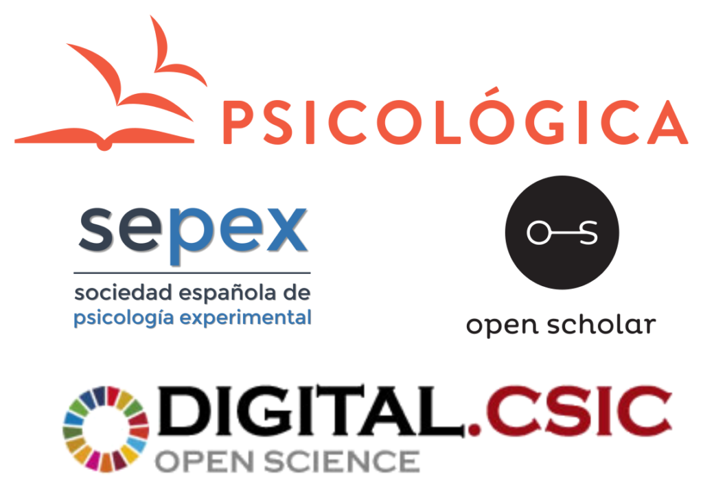

*Joint press release posted by <a href="https://openscholar.info/psicologica-and-digital-csic-join-forces-for-sustainable-diamond-open-access-and-repository-as-a-publisher-services/" target="_blank" rel="noreferrer noopener">Open Scholar</a>, <a href="https://websepex.com/psicologica-and-digital-csic-join-forces-for-sustainable-diamond-open-access-and-repository-as-a-publisher-services/" target="_blank" rel="noreferrer noopener">SEPEX</a>, and <a href="http://bibliotecas.csic.es/es/psicologica-digitalcsic-acceso-abierto-diamante-noticia" target="_blank" rel="noreferrer noopener">CSIC</a>*

We are excited to announce the relaunch of <a href="https://psicologicajournal.com/" target="_blank" rel="noreferrer noopener">Psicológica</a>, the journal of the <a href="https://websepex.com/" target="_blank" rel="noreferrer noopener">Spanish Society for Experimental Psychology</a> (SEPEX), as a Diamond Open Access journal published exclusively on <a href="https://digital.csic.es/" target="_blank" rel="noreferrer noopener">DIGITAL.CSIC</a>, the institutional repository of the <a href="https://www.csic.es/es" target="_blank" rel="noreferrer noopener">Spanish National Research Council (CSIC)</a>.

This project kicks off in a time when both the sustainability of Diamond Open Access journals and the opportunities to consolidate Repository as a Publisher services have come to the fore in global discussion about innovative scholarly communications. On the one hand, in light of the heated debates about the true costs of academic publishing, the direct partnership between a society-owned journal and a publicly funded repository demonstrates the viability of a novel and sustainable publishing model that does not entail any costs to authors, institutions, readers or libraries. On the other hand, DIGITAL.CSIC takes a further step in its agenda to expand publishing services, by providing a full peer review workflow on top of its infrastructure. A rigorous quality control of incoming manuscripts is performed by senior volunteer academics with the collaboration of expert reviewers, while the institutional repository and its staff of professional librarians provide a state-of-the-art publishing infrastructure, including peer review management, metadata curation, DOI minting, support for database indexing and harvesting by aggregators and search engines, support for policy development, users support service, and digital preservation. This whole set of services on top of an institutional repository opens the door for truly innovative publishing controlled by the scholarly community and without the intermediation of third parties.

This exciting initiative rests on the <a href="https://openscholar.info/open-peer-review-module-for-repositories/" target="_blank" rel="noreferrer noopener">Open Peer Review Module</a> (OPRM) that was <a href="https://digital.csic.es/handle/10261/131210" target="_blank" rel="noreferrer noopener">integrated into DIGITAL.CSIC</a> as a pilot project in 2016 under the coordination of <a href="https://openscholar.info/" target="_blank" rel="noreferrer noopener">Open Scholar</a> and funding from <a href="https://www.openaire.eu/" target="_blank" rel="noreferrer noopener">OpenAIRE</a>. Our experimentation with the module helped to gain important <a href="https://digital.csic.es/handle/10261/163500" target="_blank" rel="noreferrer noopener">insights into researchers' behaviours and attitudes</a> and we believe that the time is now ripe to accelerate the transition towards a new publishing ecosystem based on a network of distributed repositories with advanced overlay services, in line with the model <a href="https://www.coar-repositories.org/news-updates/what-we-do/next-generation-repositories/" target="_blank" rel="noreferrer noopener">proposed by the Confederation of Open Access Repositories (COAR)</a>.

Absolute control of the publication process, in the absence of a commercial publisher, not only eliminates costs, but also allows the implementation of a series of innovative practices guided solely by an interest in scientific quality. According to the <a href="https://psicologicajournal.com/about/#Publication-practices" target="_blank" rel="noreferrer noopener">new journal policies</a>, submitted manuscripts become immediately available in DIGITAL.CSIC as preprints. Registered reports are accepted and highly recommended, especially for replication studies. Availability of data and software code is a prerequisite for an experimental article to proceed to the review stage. Senior academic editors assign manuscripts to expert reviewers who are advised to provide signed reviews with the sole objective of improving the scientific quality of the reviewed articles. The full text of the review is published as a separate digital work with its own persistent identifier (DOI) and is linked to the reviewed manuscript. Authors' responses to reviewers are also published, making the entire scholarly discussion open. Manuscripts that at the end of the review phase meet the quality standards set by the academic editors are included in the journal's corpus and disseminated to indexing services and search engines. Importantly, authors retain the copyright of their works and are free to choose the license that best suits their interests. Last but not least, the evaluated papers, their authors, related reviews and reviewers benefit from an innovative reputation system grounded on quality ratings provided during the peer review process.

This pioneering partnership between the society journal Psicológica and DIGITAL.CSIC is coordinated by <a href="https://openscholar.info/" target="_blank" rel="noreferrer noopener">Open Scholar</a>, an international organisation with a long history in the research and development of tools to promote openness and transparency in scholarly publishing.

We declare our firm intention to further promote this innovative publishing model and invite interested parties, including society journals, libraries, repository managers, academic institutions and scholarly associations, to contact us for more information and support on initiating new projects or transitioning existing journals.

SEPEX &nbsp;&nbsp;&nbsp;&nbsp;&nbsp;&nbsp;&nbsp;&nbsp;&nbsp;&nbsp;&nbsp;&nbsp;&nbsp;&nbsp;&nbsp;&nbsp; DIGITAL.CSIC &nbsp;&nbsp;&nbsp;&nbsp;&nbsp;&nbsp;&nbsp;&nbsp;&nbsp;&nbsp;&nbsp;&nbsp;&nbsp;&nbsp;&nbsp;&nbsp; OPEN SCHOLAR

**About SEPEX**

The Spanish Society for Experimental Psychology (SEPEX) was founded in 1997 with the aim to promote the development of scientific knowledge in all fields of psychology by the dissemination of research results, the strengthening of ties between national and international counterpart societies and organisations, and the organization of scientific meetings.

The journal <a href="https://psicologicajournal.com/" target="_blank" rel="noreferrer noopener">Psicológica</a> was founded in 1980 at the University of Valencia (UV) and, soon after the creation of the SEPEX, it became the flagship journal of the society, publishing articles spanning the entire spectrum of Experimental Psychology. Currently, the journal is financially supported by both the SEPEX and the UV.

**About DIGITAL.CSIC**

DIGITAL.CSIC has been CSIC's multidisciplinary repository since 2008 and with more than 245,000 research outputs it has become the largest open access repository of its kind in Spain and is one of the top data providers to the <a href="https://osobservatory.openaire.eu/continent/europe/overview" target="_blank" rel="noreferrer noopener">Open Science system in Europe</a>.

Over the years, DIGITAL.CSIC has growingly diversified its agenda to contribute to the building of a global Open Science ecosystem. The infrastructure counts with a set of innovative services including DOI minting for non-traditional research outputs, management of different types of entities profiles, <a href="https://digital.csic.es/handle/10261/131210" target="_blank" rel="noreferrer noopener">Open Peer Review Module</a>, monitoring of Open access contents usage, assessment of compliance with FAIR Principles and data contribution to the European Open Science Cloud (EOSC).

Since 2019 <a href="https://digital.csic.es/handle/10261/179077" target="_blank" rel="noreferrer noopener">CSIC requires</a> institutional researchers to deposit and open access to peer reviewed publications and associated research data and links <a href="https://digital.csic.es/sites/monitor_mandato_oa_csic/" target="_blank" rel="noreferrer noopener">compliance</a> to institutional assessment exercises.

**About OPEN SCHOLAR**

Open Scholar was founded in 2012 as an international organisation of volunteer academics developing ideas and tools that promote open and transparent scientific collaboration for a faster, more efficient and natural organisation, evaluation and dissemination of global knowledge. The group runs several parallel projects related to the vision summarised in the <a href="https://openscholar.info/independent-peer-review-manifesto/" target="_blank" rel="noreferrer noopener">Independent Peer Review Manifesto</a>. In 2016, with the financial support of OpenAIRE, Open Scholar coordinated a consortium of five partners to develop the <a href="https://openscholar.info/open-peer-review-module-for-repositories/" target="_blank" rel="noreferrer noopener">Open Peer Review Module</a>, an open source tool that can be installed on institutional repositories to enable overlay open peer review.
