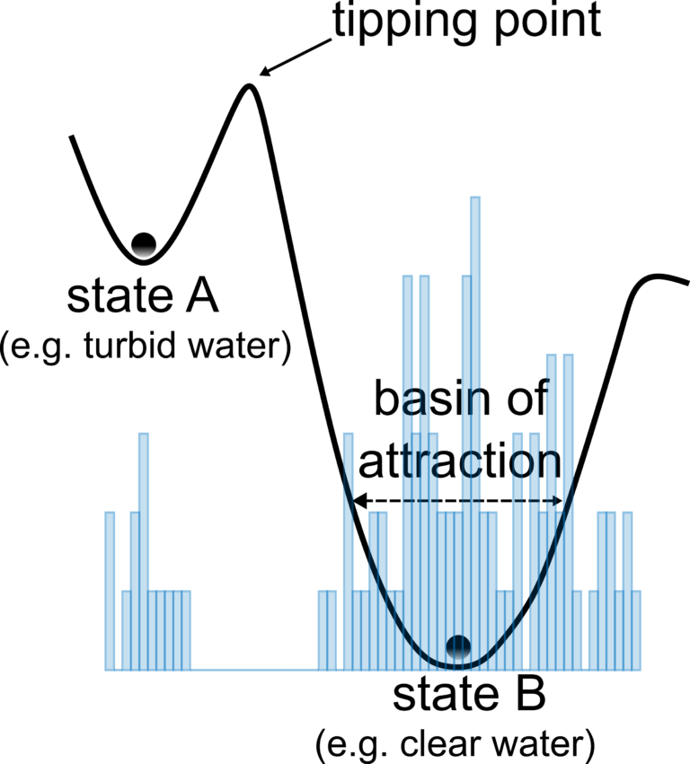
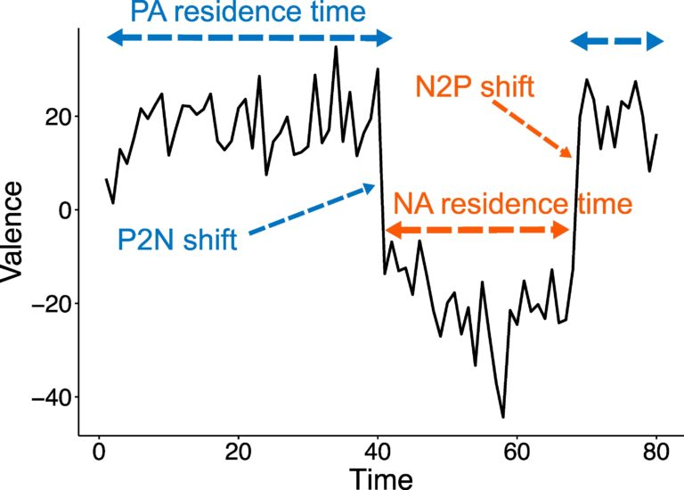

Psychological well-being is often studied through specific emotions—how happy, sad, or angry people feel. Yet, at the core of these emotions lies affect, the fundamental sense of feeling good or bad. Our recent study, published in the journal <em>Emotion</em>, explores how affective states fluctuate over time, revealing patterns that offer new insights into mental health.

### Bistability in Affective States

Human affect often resembles a lake that settles into one of two states—clear or murky—until external forces trigger a shift. This pattern, known as <strong>bistability</strong>, emerged in our research as a common trait. About 54% of healthy adults regularly switch between distinct positive and negative affective states, with abrupt transitions rather than gradual shifts. This bistable behavior, illustrated in Figure 1, challenges traditional views of affect as a continuous spectrum.

<figure style="text-align:center;">
  
  <figcaption>Figure 1. Reconstruction of a lake's stability landscape using a histogram of water transparency observations. The system's two states are shown as basins of attraction, with basin depth indicating the energy needed to reach a tipping point and shift states.</figcaption>
</figure>

### Key Findings and Methods

Our study found that psychological well-being depends less on the intensity of emotions and more on how people <strong>transition</strong> between affective states. We asked participants, "How do you feel right now?" on a scale from negative to positive, tracking their responses over time (see Figure 2). From these data, we measured:

- The frequency of shifts between positive and negative affect.
- The duration spent in each state (mean positive/negative residence time, mPRT/mNRT).
- The magnitude of these shifts (e.g., mean positive-to-negative affect shift magnitude, mP2N-ASM).

A key metric, the <strong>Positive-to-Negative Affect Shift Ratio (P2N-ASR)</strong>, proved especially telling. This ratio, which captures how often people shift from positive to negative affect relative to total measurements, strongly predicts well-being.

<figure style="text-align:center;">
  
  <figcaption>Figure 2. Components of a valence time series used to derive affect shift metrics. Blue dashed lines show consecutive measurements in the positive affect (PA) regime. A blue single-arrow line marks a positive-to-negative (P2N) shift, used to calculate the P2N affect shift ratio (P2N-ASR) and shift magnitude (mP2N-ASM). Red single-arrow lines show negative-to-positive (N2P) shifts.</figcaption>
</figure>

## Implications for Mental Health

These findings suggest that well-being depends on a healthy pattern of affective transitions—particularly the ability to return to positive states after negative ones. This approach could simplify how we assess mental health, moving beyond complex emotional questionnaires to focus on affective shifts. It may also improve clinical tools for monitoring mental health and evaluating therapies, while shedding light on psychological resilience.

For full details, see our paper in <a href="https://doi.org/10.1037/emo0001454" target="_blank" rel="noopener"><em>Emotion</em></a> or the identical <a href="https://doi.org/10.31234/osf.io/cqpuz" target="_blank" rel="noopener">open access version</a> on PsyArXiv.

