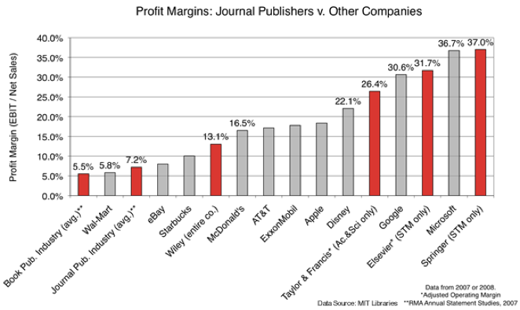

[Read in English](https://perakakis.github.io/2021/05/07/what-are-transformative-agreements-and-what-to-know-before-using-them/)

La semana pasada, los/las investigadores/as de la Universidad de Granada recibieron un correo electrónico de la directora de la Biblioteca Universitaria, anunciando lo que a primera vista parece una muy buena oferta: *"La Universidad tiene asignado un fondo para cubrir los cargos por publicación (Article Publication Charge; APC) de un número determinado de artículos en **revistas híbridas** de las **editoriales Elsevier y Wiley.**"*

Según el procedimiento descrito en el email:

> *"En la **fase final del proceso de publicación**, a la autora o autor de correspondencia, se le preguntará si quiere que la Universidad financie la APC. En el caso que decida que sí, y al seleccionar la Universidad de Granada haya fondos para la financiación, se procederá a la notificación a la Biblioteca Universitaria para que apruebe el pago de la APC por parte de la Universidad de Granada... Si el fondo de financiación de la Universidad de Granada para el cargo de APCs se ha agotado, al autor/a de la correspondencia, **en el proceso final de la publicación, no se le dará la opción de solicitar financiación a la Universidad de Granada**. En este supuesto, lo que **sí dará la plataforma de envío de manuscritos es la opción de si desea, la autora o el autor de correspondencia, financiar la APC a cargo de grupos, proyectos, etc.**"*

Antes de que todos celebremos esta gran oportunidad, les invito a reflexionar sobre algunas de sus consecuencias para la comunidad académica.

## ¿Qué son los "transformative agreements"?

Esta oferta de la Universidad de Granada es el resultado de lo que se denominan "transformative agreements", que son contratos entre las grandes editoriales comerciales y las bibliotecas universitarias, cuyo objetivo es cambiar gradualmente el negocio editorial del modelo tradicional basado en la suscripción, en el que las bibliotecas pagan por el acceso, a un modelo de acceso abierto, en el que los autores pagan por publicar. Estos acuerdos tienen diferentes características en cuanto a **costes**, **políticas de licencias** y **transparencia**. En la mayoría de los casos, la cantidad pagada por las universidades a las editoriales sigue siendo la misma, pero ahora un porcentaje de esta cantidad se paga indirectamente al proporcionar financiación para las publicaciones de acceso abierto. A los artículos de acceso abierto financiados por estos nuevos acuerdos se les suele exigir que se publiquen con licencias que permitan su reutilización y distribución sin restricciones, pero la mayoría de las veces las licencias <a href="https://peerj.com/articles/4375/" target="_blank" rel="noreferrer noopener">no son transparentes</a> y solo dan permisos de lectura, pero prohíben a usuarios y algoritmos extraer, combinar y reutilizar los datos para descubrir nuevos patrones y producir nuevos conocimientos. En lo que respecta a la transparencia, aunque se supone que los términos de los acuerdos de transformación se hacen públicos, en realidad solo se proporciona una visión general de los componentes más importantes.

## Por qué los "transformative agreements" no son un buen negocio para la ciencia

### Reforzar el oligopolio de las editoriales académicas

Aunque aparentemente se promueven con la mejor intención de aumentar el número de revistas de acceso abierto, los "transformative agreements" son una forma de **consolidar los oligopolios existentes de las cinco grandes editoriales académicas** (Elsevier, Springer Nature, Wiley, Taylor & Francis, American Chemical Society), que son las únicas capaces de negociar estos acuerdos. Esto supone una amenaza vital para las editoriales más pequeñas (por ejemplo, las editoriales de sociedad académicas) y los nuevos modelos de publicación emergentes con costes más bajos y servicios a menudo superiores (por ejemplo, las revistas "overlay"). Los autores se remiten a revistas específicas para las que se han firmado acuerdos de una manera que no solo es injusta para las revistas excluidas, sino que también debería ser **ilegal** según las **leyes antimonopolio** que protegen la sana competencia y **evitan la creación de mercados monopolísticos**. Piensa por un minuto que a ti, como investigador, no se te permite gastar tu financiación pública sin un proceso de concurso entre al menos tres candidatos potenciales. Sin embargo, las universidades tienen la libertad de firmar estos acuerdos e incentivar a sus investigadores para que ofrezcan su trabajo a colosales empresas con ánimo de lucro que llevan décadas extorsionando el mercado de las publicaciones académicas, eliminando cualquier posibilidad de competencia.

En la oferta particular de la Universidad de Granada, hay que tener en cuenta que solo en la fase final del proceso de publicación, cuando los artículos ya han sido aceptados por la revista, los autores sabrán si la financiación de los APCs está disponible a través de la biblioteca de su Universidad. Esto significa que a los autores se les anima a publicar en revistas específicas sin ninguna seguridad de que los costes de publicación serán finalmente cubiertos por su biblioteca. En cambio, cuando sus artículos son aceptados y el envío a una revista diferente, que podría haber sido más apropiada o menos costosa, es prácticamente imposible, pueden descubrir que tienen que pagar los gastos de publicación de su propio bolsillo.

Observemos también que la declaración menciona explícitamente que se trata de un acuerdo para revistas "híbridas". Se trata de revistas por las que las bibliotecas pagan las cuotas de suscripción, pero al mismo tiempo algunos de sus artículos se publican en acceso abierto si los autores pagan el APC. Este es el modelo más beneficioso para las editoriales, ya que los ingresos de las suscripciones permanecen intactos con la importante adición de los ingresos provenientes de los artículos de acceso abierto, financiados por las instituciones, las agencias de financiación o los propios autores. Por lo tanto, los artículos de acceso abierto de estas revistas son pagados dos veces, por las bibliotecas y por los autores. ¡No es tan mal negocio!

### Promover una visión distorsionada del acceso abierto

Lo que es aún más retorcido en estos acuerdos, así como en casi todos los mandatos internacionales para el acceso abierto (por ejemplo, Horizonte 2020, PlanS, etc.), es que promueven una visión tergiversada del acceso abierto en comparación con su definición original en el manifiesto de la <a href="https://www.budapestopenaccessinitiative.org/read" target="_blank" rel="noreferrer noopener">Budapest Open Access Initiative</a>. Es importante recordar que en este manifiesto, el acceso abierto a los artículos académicos se define como:

> *"...free availability on the public internet, permitting any users to **read**, **download**, **copy**, **distribute**, **print**, **search**, or **link to the full texts of these articles**, **crawl them for indexing**, **pass them as data to software**, or use them for any other lawful purpose, **without financial, legal, or technical barriers** other than those inseparable from gaining access to the internet itself."*
>
> Budapest open access initiative

El mismo manifiesto recomienda el **"self-archiving" en repositorios abiertos** (Green Open Access) como **estrategia principal** para lograr el objetivo del acceso abierto, mientras que la publicación en revistas de acceso abierto (Gold Open Access) se menciona como **estrategia secundaria**.

Es obvio que las grandes editoriales no podían permitir que esta definición de acceso abierto predominara. El consultor editorial Joseph Esposito <a href="https://scholarlykitchen.sspnet.org/2013/12/03/how-plos-one-can-have-it-all/" target="_blank" rel="noreferrer noopener">no podría haber articulado mejor las razones</a>:

> *"Green OA has no promise of delivering augmented revenues to the publisher, but **Gold OA opens up a new customer**, the author him or herself, who in many instances pays for the article to be OA. **Gold OA**, in other words, represents a **business opportunity**, whereas **Green OA** represents a **business problem**."*
>
> Joseph Esposito, Publishing consultant

Por el contrario, las acciones coordinadas de las grandes editoriales comerciales, con intensas prácticas de presión e intimidación (lobbying), consiguieron engañar a la comunidad investigadora y a los organismos internacionales de financiación para que creyeran que pagar para publicar es la única forma de alcanzar el noble objetivo de acceso abierto. Todos los días se escucha a académicos declarar con orgullo que solo publican sus investigaciones en revistas de acceso abierto sin darse cuenta de la trampa en la que se han dejado caer.

## ¿Cuánto pagamos por el acceso abierto?

Ahora que los autores tenemos que pagar por publicar nuestros trabajos en revistas académicas empezamos a darnos cuenta de los costes que esto supone. Pero todavía pocos sabemos cuánto exactamente pagan cada año las bibliotecas de nuestras universidades a las editoriales académicas. Solo en 2020, la <a href="https://gerencia.ugr.es/pages/vger_eco/presupuestos/presupuesto2020ugr" target="_blank" rel="noreferrer noopener">Universidad de Granada pagó 1.045.250 euros</a> por el acceso a revistas electrónicas (sí, el tipo de acceso que conseguimos a través de sci-hub de forma más rápida y gratuita), mientras que la <a href="https://www.ucm.es/portaldetransparencia/informacionpresupuestaria" target="_blank" rel="noreferrer noopener">Universidad Complutense de Madrid pagó 2.846.040,62 euros</a>.

Uno no puede evitar preguntarse si realmente cuesta tanto publicar artículos online en nuestra era digital. Un vistazo a los márgenes de beneficio de las mayores editoriales revela que casi la mitad de ese dinero va directamente a los bolsillos de sus accionistas, mientras que otro porcentaje importante se destina a actividades totalmente ajenas a los beneficios de la comunidad académica: marketing, lobbying, adquisiciones, etc.

El gráfico anterior muestra datos de las declaraciones anuales del "Risk Management Association", donde vemos a tres editoriales académicas entre las cinco empresas con mayores márgenes de beneficio, incluyendo todos los sectores del mercado. Podemos argumentar que otras empresas, como Microsoft, Google, Disney y Apple, ofrecen productos únicos en sus respectivos mercados que son el resultado de una importante inversión en infraestructura tecnológica y recursos humanos. Sin embargo, a diferencia de otros mercados oligopólicos, los bienes que ofrecen las editoriales académicas no dependen de una tecnología única ni del trabajo remunerado de personal especializado. **Las bibliotecas universitarias proporcionan una infraestructura de publicación más avanzada**, mientras que el servicio especializado de organizar y realizar la revisión por pares lo ofrece la comunidad académica de forma gratuita.

## Un comentario final

Durante décadas, la comunidad académica ha sido rehén de las editoriales comerciales solo porque el prestigio de sus revistas, sostenido en parte por métricas defectuosas como el factor de impacto, se utiliza para la evaluación de la calidad científica. Hemos permitido que los intereses financieros de estas empresas dicten lo que es bueno para la ciencia y lo que no. Les dejamos definir las necesidades de la comunidad académica y decidir los medios adecuados para satisfacerlas. Ideas e iniciativas que promueven una forma más abierta y eficiente de realizar y compartir el conocimiento científico se ven mermadas o engullidas y transformadas mediante adquisiciones. Todas estas son cuestiones que hay que considerar antes de aceptar estas nuevas ofertas de nuestras bibliotecas universitarias. En lugar de celebrar estos acuerdos, personalmente me siento avergonzado por las instituciones que apoyan de manera poco ética a la obsoleta industria editorial académica, pretendiendo convencer que ofrecen a sus comunidades un servicio valioso.
