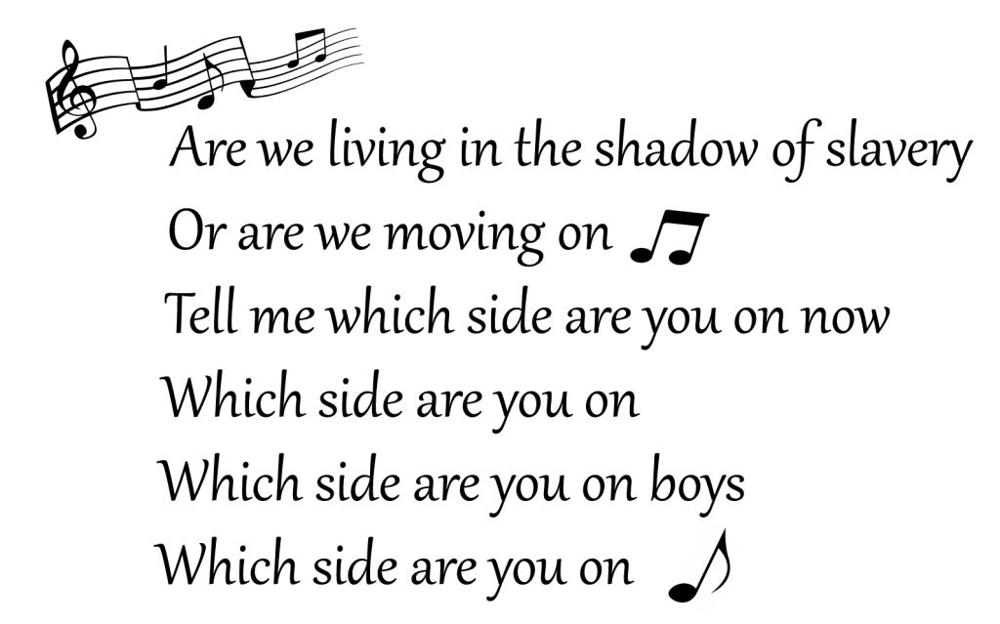

As promised, I publish here a recent correspondence between Angel Correa, a colleague at the Brain, Mind & Behaviour Research Center of the University of Granada, and the editor of an Elsevier journal. I do not wish to express my opinion here —although the title and image of this post may be giving a hint— nor to reveal the identity of the editor. I prefer to listen to what my fellow colleagues think about which are the obligations and responsibilities of authors and journal editors in the emerging landscape of open scholarly communication.

First Dr. Correa received a typical review invitation by the journal editor, to which he replied:

> Dear Dr. ...,
>
> I am happy to commit myself to write a professional signed review of this article on the following premise:
>
> If the reviewed paper is accepted, my review will be published in the same issue as a "commentary" or something similar, in open access, free.
>
> The reason is that, as a civil servant, I have decided not to use my working time to work selflessly for journals supported by private editorial companies.
>
> Please let me know if your journal could warrant so. Thank you.
>
> Best regards
>
> Angel

The editor's reply was:

> Dear Dr correa,
>
> I regret your decision not to take part of the scientific process any longer.
>
> Kind regards,

And after a few minutes, in a second email the editor added:

> Dear Angel,
>
> my opinion is that as a civil servant, it is our job to provide peer assessment, not only because our institution pays us to do so, also because the scientific community is organised in this way (you also expect your papers to be reviewed by peers). I am not sure that your institution would agree on your point of view.
>
> I respect your decision, but we do not publish review reports.
>
> Kind regards,

A little later Angel sent the following request:

> Dear ...:
>
> Thank you for your respect and your honest message, which have made me think further on this complex issue.
>
> I believe that my commitment to open science will yet remain if I keep the rights as author to publish my review for **[journal name]** by myself, in open access, in the event that the manuscript was published.
>
> Please let me know if your journal will allow to keep my rights as author of my review.
>
> Thank you,
>
> Angel

The editor never replied to this email.

Any thoughts?
