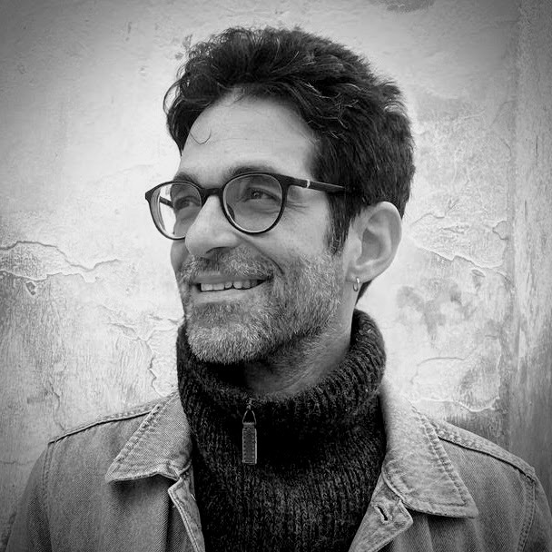

::: {.home-about}
{.home-photo}

I am an associate professor of psychology at the [Complutense University of Madrid](https://www.ucm.es). I received my PhD in clinical psychophysiology from the [University of Granada](https://www.ugr.es).

My current main research program focuses on [affect dynamics](research/affect-dynamics/index.qmd) and their relation to psychological well-being. In the past I have studied brain-heart interactions and the relation between [physical exercise and cognitive function](research/exercise-brain-cognition/index.qmd).

I am deeply concerned about the current academic publication and evaluation model and advocate for [scholar-governed alternatives](research/scholarly-communication/index.qmd), leveraging institutional repositories and implementing open peer review.

[<i class="bi bi-mortarboard-fill"></i> Google Scholar](https://scholar.google.com/citations?user=5S-EVSAAAAAJ){.btn .btn-outline-primary .btn-sm target="_blank"}
[<i class="bi bi-globe"></i> ORCID](https://orcid.org/0000-0002-9130-3247){.btn .btn-outline-primary .btn-sm target="_blank"}
[<i class="bi bi-github"></i> GitHub](https://github.com/perakakis){.btn .btn-outline-primary .btn-sm target="_blank"}
[<i class="bi bi-linkedin"></i> LinkedIn](https://www.linkedin.com/in/pandelis-perakakis-1369402a/){.btn .btn-outline-primary .btn-sm target="_blank"}
[<i class="bi bi-envelope"></i> Email](mailto:perakakis@gmail.com){.btn .btn-outline-primary .btn-sm}
:::

## What's new

::: {#recent-posts}
:::
