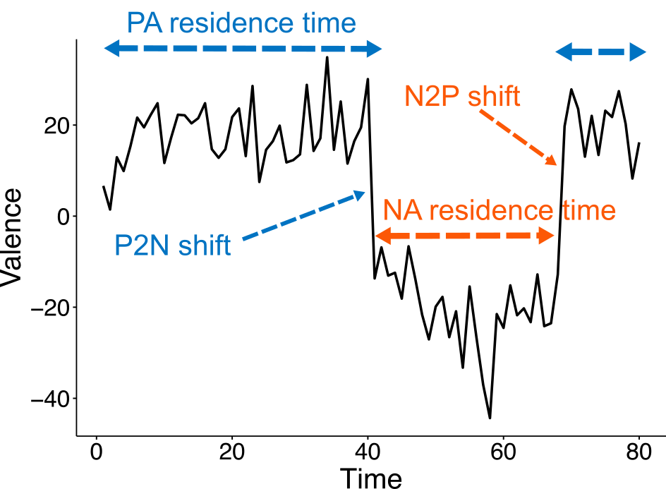

::: {.programme-overview}
{.programme-overview-img}

::: {.programme-overview-text}
Emotions are not static — they fluctuate over time, and the *pattern* of those fluctuations may matter as much as their average level for psychological well-being. Drawing on concepts from dynamical systems theory, this research line investigates how affect shifts over hours and days, and what those dynamics reveal about a person's psychological health.

We introduce concepts and tools from ecology and the study of natural complex systems to investigate the structure and function of human affect. Using Ecological Momentary Assessment (ESM), we acquire longitudinal data to explore the relation between affect shifts and psychological well-being. We explore novel network analysis and visualisation methods to map psychological processes to clinically relevant outcomes and enhance idiographic assessment and psychological treatment.

We introduce concepts and tools from ecology and the study of natural systems to investigate the structure and function of the human affect system. Using Ecological Momentary Assessment, we acquire longitudinal data to explore the relation between affect shifts and psychological well-being. We explore novel network analysis and visualisation methods to map psychological processes to clinically relevant outcomes and enhance idiographic assessment and psychological treatment.

A key finding from recent work is that emotional experience often behaves like a **bistable system**: rather than drifting gradually between positive and negative states, most people tend to remain in one state before abruptly tipping into another. This bistability — the tendency to occupy distinct emotional attractors — predicts well-being above and beyond traditional affect measures.

[<i class="bi bi-box-arrow-up-right"></i> OSF Project](https://osf.io/w8e72/overview){.btn .btn-outline-primary .btn-sm target="_blank"}
[<i class="bi bi-github"></i> GitHub](https://github.com/perakakis/affect-dynamics){.btn .btn-outline-primary .btn-sm target="_blank"}
:::
:::

## Journal articles

:::{#journal-articles}
:::

## Preprints

:::{#preprints}
:::

## Funded projects

:::{#funding}
:::

<!-- :::{#in-progress}
::: -->
