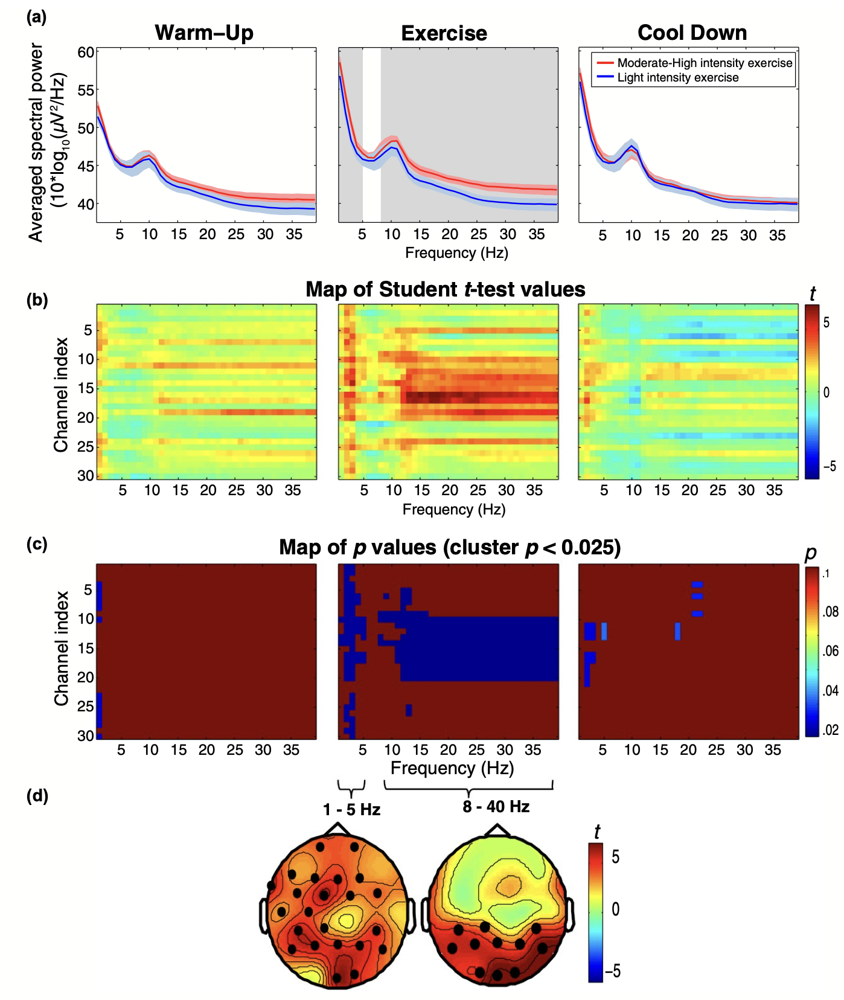

::: {.programme-overview}
{.programme-overview-img}

::: {.programme-overview-text}
A substantial body of research has reported a positive association between physical exercise and cognition, although the key factors driving that link are still a matter of scientific debate. Our work focuses on elucidating how brain physiology is affected by acute and prolonged physical exercise and how exercise-induced brain changes influence cognitive performance — with a particular focus on **sustained attention** and **cardiac interoception**.

One of our key contributions, an umbrella review of randomized control trials, indicates that the current evidence of exercise-induced cognitive benefits is weak and unreliable.

[<i class="bi bi-box-arrow-up-right"></i> Lab website](https://hbc.ugr.es/cognitive-affect-dynamics/){.btn .btn-outline-primary .btn-sm target="_blank"}
:::
:::

## Journal Articles

:::{#journal-articles}
:::

## In the News

:::{#news}
:::
