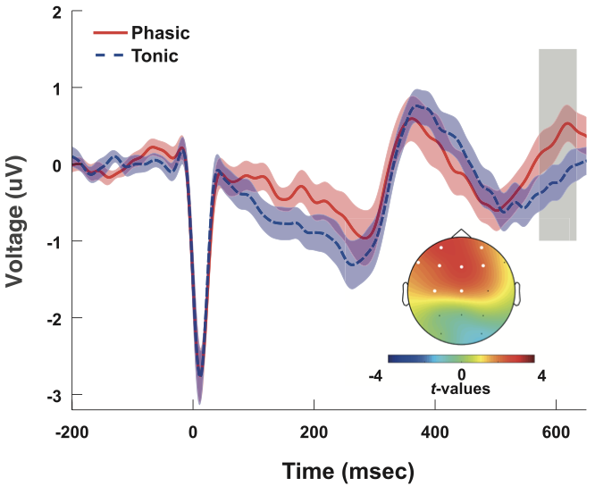

::: {.programme-overview}
{.programme-overview-img}

::: {.programme-overview-text}
The **heartbeat-evoked potential (HEP)** is an EEG response time-locked to the R-peak of the cardiac cycle. It reflects the cortical processing of afferent signals originating in the heart and is considered one of the most direct neural markers of **cardiac interoception** — the brain's monitoring of its own body.

This research line investigates how the HEP is modulated by internal states such as physical fitness, sleep stage, emotion, and psychopathology, and what role cardiac-brain coupling plays in sustained attention and self-perception. A central methodological contribution is **HEPLAB**, an open-source EEGLAB plugin for automated detection of cardiac events in raw ECG signals, developed in this lab and used by research groups worldwide.

[<i class="bi bi-github"></i> HEPLAB on GitHub](https://github.com/perakakis/HEPLAB){.btn .btn-outline-primary .btn-sm target="_blank"}
:::
:::

## Journal Articles

:::{#journal-articles}
:::

## Preprints

:::{#preprints}
:::

## Software

:::{#software}
:::

## Funded Projects

:::{#funding}
:::
