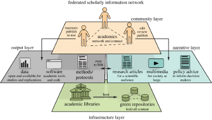

::: {.programme-overview}
{.programme-overview-img}

::: {.programme-overview-text}
The current academic publishing system — dominated by a small number of commercial publishers — is costly, restrictive, and misaligned with the interests of science and society. This research line develops theoretical models and practical tools to support a transition toward **scholar-governed, open-access publishing**.

A long engagement with scholarly communication and research evaluation led to the founding of [Open Scholar](http://www.openscholar.info/), an international organisation of researchers committed to developing and promoting alternatives to today's problematic model of academic publishing. Our work spans peer review reform, overlay journals, institutional repositories, and the broader political economy of open access.

[<i class="bi bi-box-arrow-up-right"></i> Open Scholar](http://www.openscholar.info/){.btn .btn-outline-primary .btn-sm target="_blank"}
:::
:::

## Journal Articles

:::{#journal-articles}
:::

## Invited Talks

:::{#conferences}
:::

## News

:::{#news}
:::

<!-- ## Selected News

1. [Are University ratings useful?](http://www.tovima.gr/science/article/?aid=610392) To Vima, 2014.
2. [New forms of open peer review will allow academics to separate scholarly evaluation from academic journals.](http://blogs.lse.ac.uk/impactofsocialsciences/2013/08/20/libre-project-open-peer-review-perakakis/) Impact of Social Sciences, London School of Economics.
3. [Open Scientists in the shoes of frustrated academics part I: Open-minded scepticism.](https://www.euroscientist.com/open-scientists-in-the-shoes-of-frustrated-academics-part-i-open-minded-scepticism/) Euroscientist.
4. [Open-access platform Libre launched.](http://www.timeshighereducation.co.uk/news/open-access-platform-libre-launched/2005548.article) The Times Higher Education, by Paul Jump.
5. [Too complex for the jury?](http://www.timeshighereducation.co.uk/414431.article) The Times Higher Education, by Paul Jump.
6. [Non-profit organisation 'Open Scholar C.I.C.' urges scientists to join their forces against flawed academic publishing model.](http://www.journalism.co.uk/press-releases/non-profit-organisation-open-scholar-c-i-c--urges-scientists-to-join-their-forces-against-flawed-academic-publishing-model/s66/a552352/) Journalism.co.uk. -->
