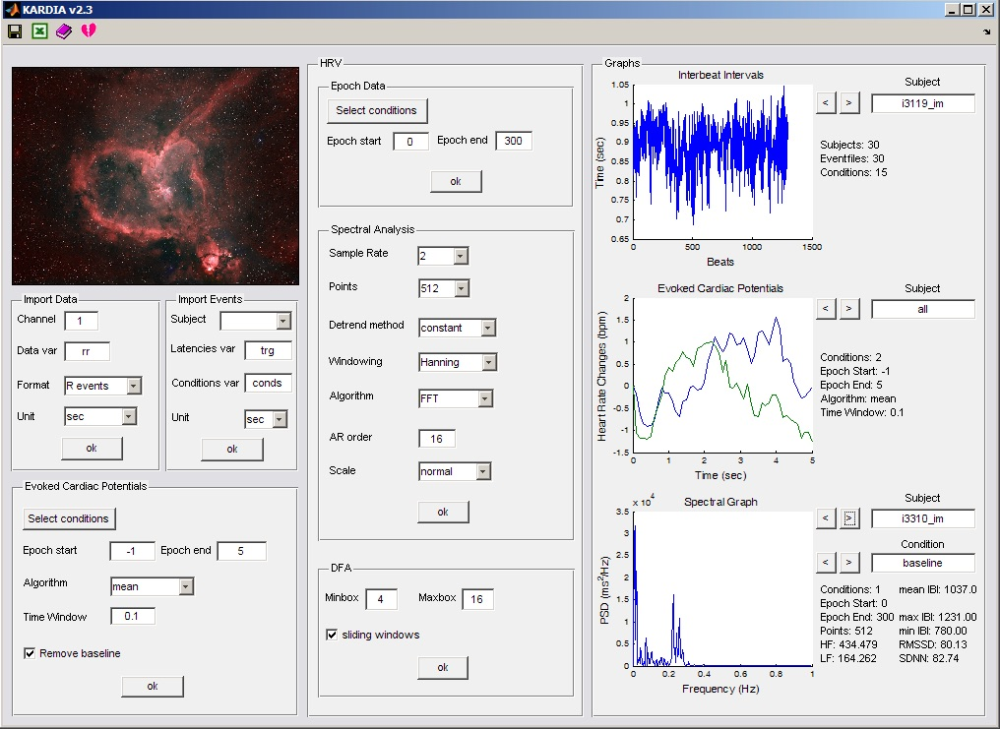
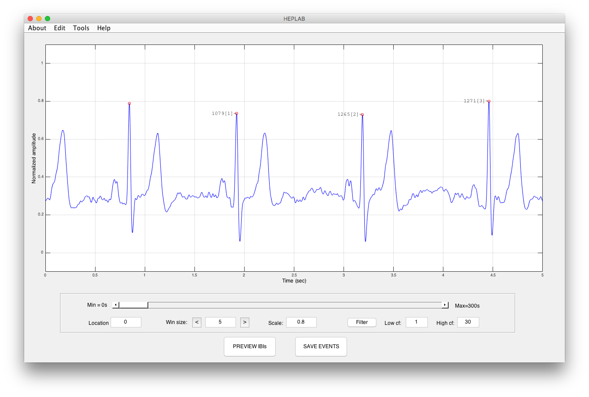

Open-source MATLAB tools I developed for psychophysiological data analysis, freely available under the GNU Public License.

::: {.card-grid}

::: {.research-card .software-card}
{.card-img-top}

### KARDIA

**MATLAB toolbox** (*καρδιά* — “heart” in Greek) for the analysis of cardiac interbeat interval data. Provides a GUI for phasic cardiac response analysis, standard HRV metrics, and detrended fluctuation analysis (DFA) of scaling exponents.

::: {.tool-badges}
MATLAB
HRV
Cardiac IBI
DFA
GNU GPL
:::

::: {.button-row}
[<i class="bi bi-github"></i> GitHub](https://github.com/perakakis/KARDIA){.btn .btn-outline-primary .btn-sm target="_blank"}
[<i class="bi bi-journal-text"></i> Journal Article](assets/Perakakis_KARDIA_2010.pdf){.btn .btn-outline-primary .btn-sm target="_blank"}
[Zenodo](https://doi.org/10.5281/zenodo.2638856){.btn .btn-outline-primary .btn-sm target="_blank"}
[SourceForge](https://sourceforge.net/projects/mykardia/){.btn .btn-outline-primary .btn-sm target="_blank"}
:::

::: {.tool-citation}
Perakakis, P., Joffily, M., Taylor, M., Guerra, P., & Vila, J. (2010). KARDIA: a Matlab software for the analysis of cardiac interbeat intervals. *Computer Methods and Programs in Biomedicine*, 98, 83–89.
:::
:::

::: {.research-card .software-card}
{.card-img-top}

### HEPLAB

**EEGLAB plugin** and standalone MATLAB toolbox for the analysis of the Heartbeat-Evoked Potential (HEP). Automates R-wave and T-wave detection from raw ECG with an interactive GUI for artifact correction, and exports events directly to EEGLAB’s EEG structure.

::: {.tool-badges}
MATLAB
EEGLAB
HEP
ECG
GNU GPL
:::

::: {.button-row}
[<i class="bi bi-github"></i> GitHub](https://github.com/perakakis/HEPLAB){.btn .btn-outline-primary .btn-sm target="_blank"}
[Zenodo](https://doi.org/10.5281/zenodo.2650275){.btn .btn-outline-primary .btn-sm target="_blank"}
:::

::: {.tool-citation}
Perakakis, P. (2019). HEPLAB: A Matlab graphical interface for the preprocessing of the heartbeat-evoked potential. *Zenodo*.
:::
:::

:::
